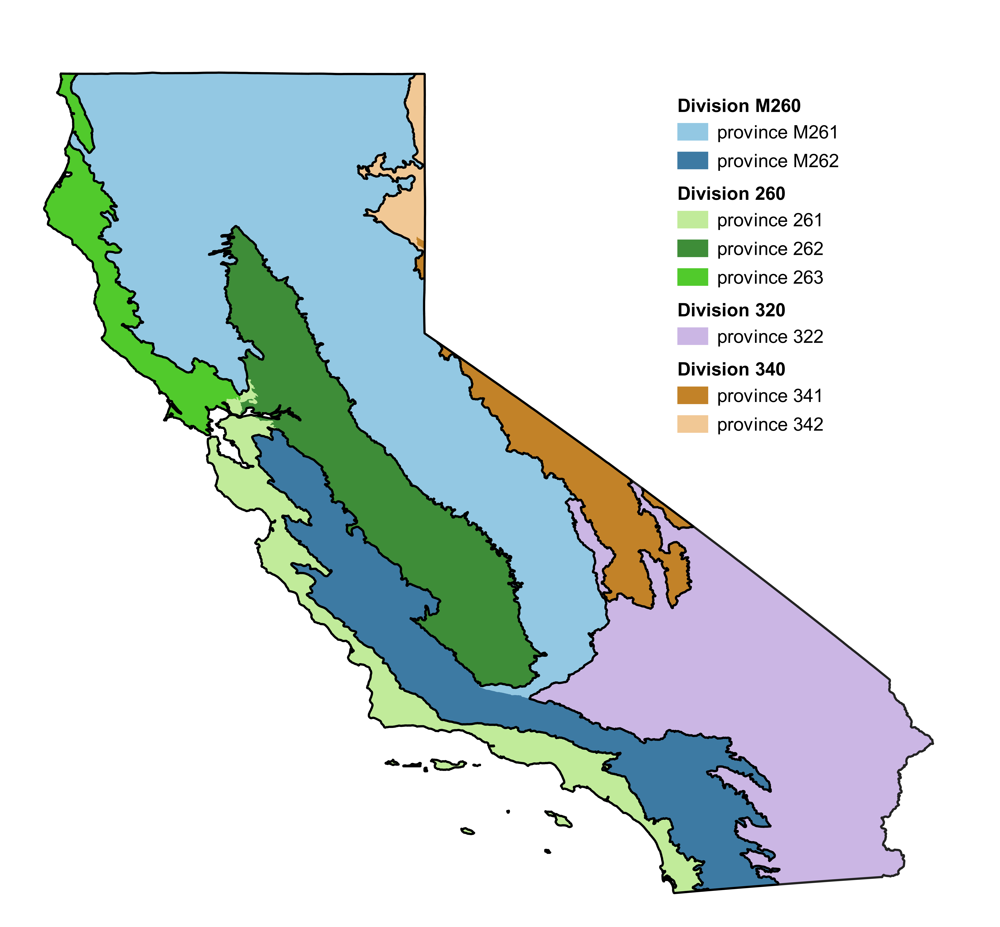

# Berkeley Forests Analystics 

The `BerkeleyForestsAnalytics` package is a suite of open-source R functions designed to produce standard metrics for forest management and ecology from field inventory data. 

> **Tip:** you can navigate this README file using the table of contents found in the upper right-hand corner.

## Installation instructions

To install the `BerkeleyForestsAnalytics` package from GitHub:

```r
# install and load devtools
install.packages("devtools")
library(devtools)
```

```r
# install and load BerkeleyForestsAnalytics 
devtools::install_github('kearutherford/BerkeleyForestsAnalytics')
library(BerkeleyForestsAnalytics)
```

```r
# install and load BerkeleyForestsAnalytics 
# and request vignettes
devtools::install_github('kearutherford/BerkeleyForestsAnalytics', build_vignettes = TRUE)
library(BerkeleyForestsAnalytics)
```

## Citation instructions 

```{r}
citation("BerkeleyForestsAnalytics")
```

## Vignette

To access the Vignette for `BerkeleyForestsAnalytics`: 

```r
# Option 1: 
browseVignettes("BerkeleyForestsAnalytics")

# Option 2:
vignette("BerkeleyForestsAnalytics", package = "BerkeleyForestsAnalytics")
```

# Tree biomass estimates (prior to NSVB framework) 

These biomass functions (`TreeBiomass` and `SummaryBiomass`) use Forest Inventory and Analysis (FIA) Regional Biomass Equations (prior to the new national-scale volume and biomass (NSVB) framework) to estimate above-ground stem, bark, and branch tree biomass. `BerkeleyForestsAnalytics` also offers the new national-scale volume and biomass (NSVB) framework (see "Tree biomass and carbon estimates (NSVB framework)" section below). 

## :eight_spoked_asterisk: `TreeBiomass( )`

The `TreeBiomass` function uses the Forest Inventory and Analysis (FIA) Regional Biomass Equations (prior to the new national-scale volume and biomass (NSVB) framework) to estimate above-ground stem, bark, and branch tree biomass. It provides the option to adjust biomass estimates for the structural decay of standing dead trees. See "Background information for tree biomass estimations (prior to NSVB framework)" below for further details.  

### Inputs

1. `data` A dataframe or tibble. Each row must be an observation of an individual tree.

2. `status` Must be a character variable (column) in the provided dataframe or tibble. Specifies whether the individual tree is alive (1) or dead (0).

3. `species` Must be a character variable (column) in the provided dataframe or tibble. Specifies the species of the individual tree. Must follow four-letter species code or FIA naming conventions (see "Species code tables" section in "General background information for tree biomass estimations" below).

4. `dbh` Must be a numeric variable (column) in the provided dataframe or tibble. Provides the diameter at breast height (DBH) of the individual tree in either centimeters or inches. 

5. `ht` Must be a numeric variable (column) in the provided dataframe or tibble. Provides the height of the individual tree in either meters or feet.

6. `decay_class` Default is set to "ignore", indicating that biomass estimates for standing dead trees will not be adjusted for structural decay (see "Structural decay of standing dead trees" section in "Background information for tree biomass estimations (prior to NSVB framework)" below). It can be set to a character variable (column) in the provided dataframe or tibble. For standing dead trees, the decay class should be 1, 2, 3, 4, or 5 (see "Decay class code table" section in "General background information for tree biomass estimations" below). For live trees, the decay class should be NA or 0.

7. `sp_codes` Not a variable (column) in the provided dataframe or tibble. Specifies whether the species variable follows the four-letter code or FIA naming convention (see "Species code tables" section in "General background information for tree biomass estimations" below). Must be set to either "4letter" or "fia". The default is set to "4letter".

8. `units` Not a variable (column) in the provided dataframe or tibble. Specifies whether the dbh and ht variables were measured using metric (centimeters and meters) or imperial (inches and feet) units. Also specifies whether the results will be given in metric (kilograms) or imperial (US tons) units. Must be set to either "metric" or "imperial". The default is set to "metric".

### Outputs

The original dataframe will be returned, with four new columns. If decay_class is provided, the biomass estimates for standing dead trees will be adjusted for structural decay.

1. `stem_bio_kg` (or `stem_bio_tons`): biomass of stem in kilograms (or US tons)

2. `bark_bio_kg` (or `bark_bio_tons`): biomass of bark in kilograms (or US tons)

3. `branch_bio_kg` (or `branch_bio_tons`): biomass of branches in kilograms (or US tons)

4. `total_bio_kg` (or `total_bio_tons`): biomass of tree (stem + bark + branches) in kilograms (or US tons)

*Important note: For some hardwood species, the `stem_bio` includes bark and branch biomass. In these cases, bark and branch biomass are not available as separate components of total biomass. `bark_bio` and `branch_bio` will appear as `NA` and the `total_bio` will be equivalent to the `stem_bio`.*

### Demonstrations

```{r, include = FALSE}
library(BerkeleyForestsAnalytics)
```

```{r}
# investigate input dataframe
bio_demo_data
```

```{r}
# call the TreeBiomass() function in the BerkeleyForestsAnalytics package
# keep default decay_class (= "ignore"), sp_codes (= "4letter") and units (= "metric")
tree_bio_demo1 <- TreeBiomass(data = bio_demo_data,
                              status = "Live",
                              species = "SPP",
                              dbh = "DBH_CM",
                              ht = "HT_M")

tree_bio_demo1
```

**Notice in the output dataframe:**

* QUKE (California black oak) has `NA` `bark_bio_kg` and `branch_bio_kg`. For some hardwood species, the `stem_bio_kg` includes bark and branch biomass. In these cases, bark and branch biomass are not available as separate components of total biomass. 

* The column names of the input dataframe will remain intact in the output dataframe.

* The `Forest`, `Plot_id`, `SPH`, and `Decay` columns, which are not directly used in the biomass calculations, remain in the output dataframe. Any additional columns in the input dataframe will remain in the output dataframe.

<br>

```{r}
# call the TreeBiomass() function in the BerkeleyForestsAnalytics package
# keep default decay_class (= "ignore"), sp_codes (= "4letter") and units (= "metric")
tree_bio_demo2 <- TreeBiomass(data = bio_demo_data,
                              status = "Live",
                              species = "SPP",
                              dbh = "DBH_CM",
                              ht = "HT_M",
                              decay_class = "Decay",
                              sp_codes = "4letter",
                              units = "metric")

tree_bio_demo2
```

**Notice in the output dataframe:**

* Comparing between the outputs from demo1 and demo2:
    * For the three standing dead trees, the biomass estimates are adjusted for structural decay. 
    * For the live trees, the biomass estimates remain the same. 

<br>

## :eight_spoked_asterisk: `SummaryBiomass( )`

The `SummaryBiomass` function calls on the `TreeBiomass` function described above. Additionally, the outputs are summarized by plot or by plot as well as species. 

### Inputs

1. `data` A dataframe or tibble. Each row must be an observation of an individual tree.

2. `site` Must be a character variable (column) in the provided dataframe or tibble. Describes the broader location or forest where the data were collected.

3. `plot` Must be a character variable (column) in the provided dataframe or tibble. Identifies the plot in which the individual tree was measured.

4. `exp_factor` Must be a numeric variable (column) in the provided dataframe or tibble. The expansion factor specifies the number of trees per hectare (or per acre) that a given plot tree represents.

5. `status` Must be a character variable (column) in the provided dataframe or tibble. Specifies whether the individual tree is alive (1) or dead (0).

6. `decay_class` Must be a character variable (column) in the provided dataframe or tibble (see "Structural decay of standing dead trees" section in "Background information for tree biomass estimations (prior to NSVB framework)" below). For standing dead trees, the decay class should be 1, 2, 3, 4, or 5 (see "Decay class code table" section in "General background information for tree biomass estimations" below). For live trees, the decay class should be NA or 0.

7. `species` Must be a character variable (column) in the provided dataframe or tibble. Specifies the species of the individual tree. Must follow four-letter species code or FIA naming conventions (see "Species code tables" in "General background information for tree biomass estimations" below).

8. `dbh` Must be a numeric variable (column) in the provided dataframe or tibble. Provides the diameter at breast height (DBH) of the individual tree in either centimeters or inches. 

9. `ht` Must be a numeric variable (column) in the provided dataframe or tibble. Provides the height of the individual tree in either meters or feet.

10. `sp_codes` Not a variable (column) in the provided dataframe or tibble. Specifies whether the species variable follows the four-letter code or FIA naming convention (see "Species code tables" section in "General background information for tree biomass estimations" below). Must be set to either "4letter" or "fia". The default is set to "4letter".

11. `units` Not a variable (column) in the provided dataframe or tibble. Specifies (1) whether the dbh and ht variables were measured using metric (centimeters and meters) or imperial (inches and feet) units; (2) whether the expansion factor is in metric (stems per hectare) or imperial (stems per acre) units; and (3) whether results will be given in metric (megagrams per hectare) or imperial (US tons per acre) units. Must be set to either "metric" or "imperial". The default is set to "metric".

12. `results` Not a variable (column) in the provided dataframe or tibble. Specifies whether the results will be summarized by plot or by plot as well as species. Must be set to either "by_plot" or "by_species." The default is set to "by_plot".

### Outputs

A dataframe with the following columns: 

1. `site`: as described above

2. `plot`: as described above

3. `species`: if results argument was set to "by_species"

4. `live_Mg_ha` (or `live_ton_ac`): above-ground live tree biomass in megagrams per hectare (or US tons per acre)

5. `dead_Mg_ha` (or `dead_ton_ac`): above-ground dead tree biomass in megagrams per hectare (or US tons per acre)

### Demonstrations 

```{r}
# investigate input dataframe
bio_demo_data
```

<br>

**Results summarized by plot:**
```{r}
# call the SummaryBiomass() function in the BerkeleyForestsAnalytics package
# keep default sp_codes (= "4letter") and units (= "metric")
sum_bio_demo1 <- SummaryBiomass(data = bio_demo_data,
                                site = "Forest",
                                plot = "Plot_id",
                                exp_factor = "SPH",
                                status = "Live",
                                decay_class = "Decay",
                                species = "SPP",
                                dbh = "DBH_CM",
                                ht = "HT_M",
                                results = "by_plot")

sum_bio_demo1
```

<br>

**Results summarized by plot as well as by species:**
```{r}
# call the SummaryBiomass() function in the BerkeleyForestsAnalytics package
# keep default sp_codes (= "4letter") and units (= "metric")
sum_bio_demo2 <- SummaryBiomass(data = bio_demo_data,
                                site = "Forest",
                                plot = "Plot_id",
                                exp_factor = "SPH",
                                status = "Live",
                                decay_class = "Decay",
                                species = "SPP",
                                dbh = "DBH_CM",
                                ht = "HT_M",
                                results = "by_species")

sum_bio_demo2
```

<br>

**If there are plots without trees:**
```{r}
# investigate input dataframe
bio_NT_demo
```

```{r}
# call the SummaryBiomass() function in the BerkeleyForestsAnalystics package
sum_bio_demo3 <- SummaryBiomass(data = bio_NT_demo,
                                site = "Forest",
                                plot = "Plot_id",
                                exp_factor = "SPH",
                                status = "Live",
                                decay_class = "Decay",
                                species = "SPP",
                                dbh = "DBH_CM",
                                ht = "HT_M",
                                results = "by_plot")

sum_bio_demo3
```

*Notice that the plot without trees has 0 live and dead biomass.*

<br>

# Tree biomass and carbon estimates (NSVB framework) 

The `BiomassNSVB` function follows the new national-scale volume and biomass (NSVB) framework to estimate above-ground wood, bark, branch, merchantable, stump, and foliage tree biomass and carbon. See “Background information for tree biomass estimations (NSVB framework)” below for further details.

## :eight_spoked_asterisk: `BiomassNSVB( )`

### Inputs

1. `data` A dataframe or tibble. Each row must be an observation of an individual tree. Must have at least these columns (column names are exact):

    * **division:** Must be a character variable. Describes the ecodivision in which the data were collected (see "CA division and provinces" section in "Background information for tree biomass estimates (NSVB framework)" below).
    
    * **province:** Must be a character variable. Describes the province (within the ecodivision) in which the data were collected (see "CA division and provinces" section in "Background information for tree biomass estimates (NSVB framework)" below).

    * **site:** Must be a character variable. Describes the broader location or forest where the data were collected.

    * **plot:** Must be a character variable. Identifies the plot in which the individual tree was measured.

    * **exp_factor:** Must be a numeric variable. The expansion factor specifies the number of trees per hectare (or per acre) that a given plot tree represents.

    * **status:** Must be a character variable. Specifies whether the individual tree is alive (1) or dead (0).

    * **decay_class:** Must be a character variable. For standing dead trees, the decay class should be 1, 2, 3, 4, or 5 (see "Decay class code table" section in "General background information for tree biomass estimations" below). For live trees, the decay class should be NA or 0.

    * **species:** Must be a character variable. Specifies the species of the individual tree. Must follow four-letter species code or FIA naming conventions (see "Species code tables" in "General background information for tree biomass estimations" below).

    * **dbh:** Must be a numeric variable. Provides the diameter at breast height (DBH) of the individual tree in either centimeters or inches. 

    * **ht1:** Must be a numeric variable. Required for trees with or without tops. For trees with tops (top = Y), ht1 is the measured height of the individual tree in either meters or feet. For trees without tops (top = N), ht1 is the estimated height of the tree with its top in either meters or feet (in this case, ht1 would likely be estimated using regional allometric equations). 
    
    * **ht2:** Must be a numeric variable. Only required for trees without tops (top = N). For trees without tops, ht2 is the "actual height" (i.e., measured height) of the individual tree in either meters or feet.
    
    * **crown_ratio:** Must be a numeric variable. Provides the live crown ratio of the individual tree (between 0 and 1). 
        
    * **top:** Must be a character variable. Specifies whether the individual tree has its top, yes (Y) or no (N).
            
    * **cull:** Must be a numeric variable. Provides the percent wood cull of the individual tree (between 0 and 100). 

2. `sp_codes` Not a variable (column) in the provided dataframe or tibble. Specifies whether the species variable follows the four-letter code or FIA naming convention (see "Species code tables" section in "General background information for tree biomass estimations" below). Must be set to either "4letter" or "fia". The default is set to "4letter".

3. `input_units` Not a variable (column) in the provided dataframe or tibble. Specifies (1) whether the input dbh, ht1, and ht2 variables were measured using metric (centimeters and meters) or imperial (inches and feet) units; and (2) whether the input expansion factor is in metric (stems per hectare) or imperial (stems per acre) units. Must be set to either "metric" or "imperial". The default is set to "metric".

4. `output_units` Not a variable (column) in the provided dataframe or tibble. Specifies whether results will be given in metric (kilograms or megagrams per hectare) or imperial (US tons or US tons per acre) units. Must be set to either "metric" or "imperial". The default is set to "metric".

5. `results` Not a variable (column) in the provided dataframe or tibble. Specifies whether the results will be summarized by tree, by plot, by plot as well as species, by plot as well as status (live/dead), or by plot as well as species and status. Must be set to either "by_tree", "by_plot", "by_species", "by_status", or "by_sp_st". The default is set to "by_plot".

### Outputs

Depends on the results setting: 

* by_tree: a list with two components: (1) total run time for the function and (2) a dataframe with tree-level biomass and carbon estimates.

* by_plot: a list with two components: (1) total run time for the function and (2) a dataframe with plot-level biomass and carbon estimates.

* by_species: a list with two components: (1) total run time for the function and (2) a dataframe with plot-level biomass and carbon estimates, further summarized by species. 

* by_status: a list with two components: (1) total run time for the function and (2) a dataframe with plot-level biomass and carbon estimates, further summarized by status.

* by_sp_st: a list with two components: (1) total run time for the function and (2) a dataframe with plot-level biomass and carbon estimates, further summarized by species as well as by status.

<br>

How to interpret column names of the output dataframe: 

* **total_wood:** total inside-bark stem wood biomass (or carbon)
* **total_bark:** total stem bark biomass (or carbon)
* **total_branch:** total branch biomass (or carbon)
* **total_ag:** total above-ground biomass (or carbon), total_wood + total_bark + total_branch 
* **merch_wood:** merchantable inside-bark stem wood biomass (or carbon)
* **merch_bark:** merchantable stem bark biomass (or carbon)
* **merch_total:** merchantable outside-bark stem biomass (or carbon), merch_wood + merch_bark
* **merch_top:** biomass (or carbon) in the top and branches of the tree (i.e., the sum of the branches and the non-merchantable top)
* **stump_wood:** stump inside-bark stem wood biomass (or carbon)
* **stump_bark:** stump stem bark biomass (or carbon)
* **stump_total:** stump outside-bark stem biomass (or carbon), stump_wood + stump_bark
* **foliage:** foliage biomass (or carbon)
* **L:** live 
* **D:** dead 
* **C:** carbon (will be in same units as biomass)
* **kg:** kilograms 
* **Mg_ha:** megagrams per hectare 
* **tons:** US tons 
* **t_ac:** US tons per acre 

### Demonstrations

```{r}
# investigate input dataframe
nsvb_demo
```

*Notice that site = YOMI, plot = 2 is a plot without trees. For all plot-level summaries below, this plot without trees will have 0 biomass/carbon estimates.*

<br>

**Results by tree:**
```{r}
# call the BiomassNSVB() function in the BerkeleyForestsAnalytics package
# keep default sp_codes (= "4letter"), input_units (= "metric"), and output_units (= "metric")
nsvb_demo1 <- BiomassNSVB(data = nsvb_demo,
                          results = "by_tree")

nsvb_demo1$run_time
head(nsvb_demo1$dataframe, 3)
```

<br>

**Results summarized by plot:**
```{r}
# call the BiomassNSVB() function in the BerkeleyForestsAnalytics package
# keep default sp_codes (= "4letter"), input_units (= "metric"), output_units (= "metric"), and results (= "by_plot")
nsvb_demo2 <- BiomassNSVB(data = nsvb_demo)

nsvb_demo2
```

<br>

**Results summarized by plot as well as by species:**
```{r}
# call the BiomassNSVB() function in the BerkeleyForestsAnalytics package
# keep default sp_codes (= "4letter"), input_units (= "metric"), and output_units (= "metric")
nsvb_demo3 <- BiomassNSVB(data = nsvb_demo,
                          results = "by_species")

nsvb_demo3
```

<br>

**Results summarized by plot as well as by status:**
```{r}
# call the BiomassNSVB() function in the BerkeleyForestsAnalytics package
# keep default sp_codes (= "4letter"), input_units (= "metric"), and output_units (= "metric")
nsvb_demo4 <- BiomassNSVB(data = nsvb_demo,
                          results = "by_status")

nsvb_demo4
```

<br>

**Results summarized by plot as well as by species and status:**
```{r}
# call the BiomassNSVB() function in the BerkeleyForestsAnalytics package
# keep default sp_codes (= "4letter"), input_units (= "metric"), and output_units (= "metric")
nsvb_demo5 <- BiomassNSVB(data = nsvb_demo,
                          results = "by_sp_st")

nsvb_demo5
```

<br>

# Forest composition and structure compilations  

The forest composition and structure functions (`ForestComp` and `ForestStr`) assist with common plot-level data compilations. These functions help ensure that best practices in data compilation are observed.

## :eight_spoked_asterisk: `ForestComp( )`

### Inputs

1. `data` A dataframe or tibble. Each row must be an observation of an individual tree.

2. `site` Must be a character variable (column) in the provided dataframe or tibble. Describes the broader location or forest where the data were collected.

3. `plot` Must be a character variable (column) in the provided dataframe or tibble. Identifies the plot in which the individual tree was measured.

4. `exp_factor` Must be a numeric variable (column) in the provided dataframe or tibble. The expansion factor specifies the number of trees per hectare (or per acre) that a given plot tree represents.

5. `status` Must be a character variable (column) in the provided dataframe or tibble. Specifies whether the individual tree is alive (1) or dead (0).

6. `species` Must be a character variable (column) in the provided dataframe or tibble. Specifies the species of the individual tree.

7. `dbh` Must be a numeric variable (column) in the provided dataframe or tibble. Provides the diameter at breast height (DBH) of the individual tree in either centimeters or inches.

8. `relative` Not a variable (column) in the provided dataframe or tibble. Specifies whether forest composition should be measured as relative basal area or relative density. Must be set to either "BA" or "density". The default is set to "BA".

9. `units` Not a variable (column) in the provided dataframe or tibble. Specifies whether the dbh variable was measured using metric (centimeters) or imperial (inches) units. Must be set to either "metric" or "imperial". The default is set to "metric".

### Outputs

A dataframe with the following columns: 

1. `site`: as described above

2. `plot`: as described above

3. `species`: as described above 

4. `dominance`: relative basal area (or relative density) in percent (%). Only compiled for LIVE trees. 

### Demonstrations

```{r}
# investigate input dataframe
for_demo_data
```

<br>

**Composition measured as relative basal area:**
```{r}
# call the ForestComp() function in the BerkeleyForestsAnalystics package
# keep default relative (= "BA") and units (= "metric")
comp_demo1 <- ForestComp(data = for_demo_data,
                         site = "Forest",
                         plot = "Plot_id",
                         exp_factor = "SPH",
                         status = "Live",
                         species = "SPP",
                         dbh = "DBH_CM")

comp_demo1
```

<br>

**Composition measured as relative density:**
```{r}
# call the ForestComp() function in the BerkeleyForestsAnalystics package
comp_demo2 <- ForestComp(data = for_demo_data,
                         site = "Forest",
                         plot = "Plot_id",
                         exp_factor = "SPH",
                         status = "Live",
                         species = "SPP",
                         dbh = "DBH_CM",
                         relative = "density",
                         units = "metric")

comp_demo2
```

<br>

**If there are plots without trees:**
```{r}
# investigate input dataframe
for_NT_demo
```

```{r}
# call the ForestComp() function in the BerkeleyForestsAnalystics package
comp_demo3 <- ForestComp(data = for_NT_demo,
                         site = "Forest",
                         plot = "Plot_id",
                         exp_factor = "SPH",
                         status = "Live",
                         species = "SPP",
                         dbh = "DBH_CM")

comp_demo3
```

*Notice that the plot without trees has NA dominance for all species.*

<br>

## :eight_spoked_asterisk: `ForestStr( )`

### Inputs

1. `data` A dataframe or tibble. Each row must be an observation of an individual tree.

2. `site` Must be a character variable (column) in the provided dataframe or tibble. Describes the broader location or forest where the data were collected.

3. `plot` Must be a character variable (column) in the provided dataframe or tibble. Identifies the plot in which the individual tree was measured.

4. `exp_factor` Must be a numeric variable (column) in the provided dataframe or tibble. The expansion factor specifies the number of trees per hectare (or per acre) that a given plot tree represents.

5. `dbh` Must be a numeric variable (column) in the provided dataframe or tibble. Provides the diameter at breast height (DBH) of the individual tree in either centimeters or inches.

6. `ht` Default is set to "ignore", which indicates that tree heights were not taken. If heights were taken, it can be set to a numeric variable (column) in the provided dataframe or tibble, providing the height of the individual tree in either meters or feet.

7. `units` Not a variable (column) in the provided dataframe or tibble. Specifies (1) whether the dbh and ht variables were measured using metric (centimeters and meters) or imperial (inches and feet) units; (2) whether the expansion factor is in metric (stems per hectare) or imperial (stems per acre) units; and (3) whether results will be given in metric or imperial units. Must be set to either "metric" or "imperial". The default is set to "metric".

### Outputs

A dataframe with the following columns: 

1. `site`: as described above

2. `plot`: as described above

3. `sph` (or `spa`): stems per hectare (or stems per acre)

4. `ba_m2_ha` (or `ba_ft2_ac`): basal area in meters squared per hectare (or feet squared per acre)

5. `qmd_cm` (or `qmd_in`): quadratic mean diameter in centimeters (or inches). Weighted by the expansion factor.

6. `dbh_cm` (or `dbh_in`): average diameter at breast height in centimeters (or inches). Weighted by the expansion factor.

7. `ht_m` (or `ht_ft`): average height in meters (or feet) if ht argument was set. Weighted by the expansion factor.

### Demonstrations

```{r}
# investigate input dataframe
for_demo_data
```

<br>

**If tree heights were not measured:**
```{r}
# call the ForestStr() function in the BerkeleyForestsAnalystics package
# keep default ht (= "ignore") and units (= "metric")
str_demo1 <- ForestStr(data = for_demo_data,
                       site = "Forest",
                       plot = "Plot_id",
                       exp_factor = "SPH",
                       dbh = "DBH_CM")

str_demo1
```

<br>

**If tree heights were measured:**
```{r}
# call the ForestStr() function in the BerkeleyForestsAnalystics package
str_demo2 <- ForestStr(data = for_demo_data,
                       site = "Forest",
                       plot = "Plot_id",
                       exp_factor = "SPH",
                       dbh = "DBH_CM",
                       ht = "HT_M",
                       units = "metric")

str_demo2
```

<br>

**If there are plots without trees:**
```{r}
# investigate input dataframe
for_NT_demo
```

```{r}
# call the ForestStr() function in the BerkeleyForestsAnalystics package
str_demo3 <- ForestStr(data = for_NT_demo,
                       site = "Forest",
                       plot = "Plot_id",
                       exp_factor = "SPH",
                       dbh = "DBH_CM",
                       ht = "HT_M",
                       units = "metric")

str_demo3
```

*Notice that the plot without trees has 0 stems/ha, 0 basal area, NA QMD, NA DBH, and NA height.*

<br>

# Surface and ground fuel load estimations 

The three functions (`FineFuels`, `CoarseFuels` and `LitterDuff`) estimate surface and ground fuel loads from line-intercept transects. Field data should have been collected following Brown (1974) or a similar method. See "Background information for surface and ground fuel load calculations" below for further details. 

This set of functions evolved from Rfuels, a package developed by Danny Foster ([See Rfuels GitHub](https://github.com/danfosterfire/Rfuels)). 
Although these functions are formatted differently than Rfuels, they follow the same general equations. The goal of this set of functions is to take the workflow outlined in Rfuels and make it more flexible and user-friendly. Rfuels will remain operational as the legacy program. 

## :eight_spoked_asterisk: `FineFuels( )`

The `FineFuels` function estimates fine woody debris (FWD) loads. FWD is defined as 1-hour (0-0.64cm or 0-0.25in), 10-hour (0.64-2.54cm or 0.25-1.0in), and 100-hour (2.54-7.62cm or 1-3in) fuels. Assumptions for FWD data collection: 

* Each plot has one or more fuel transects (the number of transects per plot is variable)
* For pre-defined distances along each transect, the number of 1-hour, 10-hour, and 100-hour fuel particles that intersect the transect are recorded as counts
* The distances (or lengths) sampled along the transect may be different for each size class (1-hour, 10-hour, and 100-hour)

### Inputs

1. `tree_data` A dataframe or tibble. Each row must be an observation of an individual tree. Must have at least these columns (column names are exact):

    * **time:** Depending on the project, the time identifier could be the year of measurement, the month of measurement, etc. For example, if plots are remeasured every summer for five years, the time identifier might be the year of measurement. If plots were measured pre- and post-burn, the time identifier might be "pre" or "post". If time is not important (e.g., all plots were measured once in the same summer), the time identifier might be set to all the same year. Time identifier is very flexible, and should be used as appropriate depending on the design of the study. The class of this variable must be character.
    * **site:** Describes the broader location or forest where the data were collected. The class of this variable must be character.
    * **plot:** Identifies the plot in which the individual tree was measured. The class of this variable must be character.
    * **exp_factor:** The expansion factor specifies the number of trees per hectare (or per acre) that a given plot tree represents. The class of this variable must be numeric. 
    * **species:** Specifies the species of the individual tree. Must follow four-letter species code or FIA naming conventions (see "Species code tables" section in "Background information for tree biomass estimations" below). The class of this variable must be character. 
    * **dbh:** Provides diameter at breast height of the individual tree in either centimeters or inches. The class of this variable must be numeric.

2. `fuel_data` A dataframe or tibble. Each row must be an observation of an individual transect at a specific time/site/plot. Must have at least these columns (column names exact):

    * **time:** Depending on the project, the time identifier could be the year of measurement, the month of measurement, etc. For example, if plots are remeasured every summer for five years, the time identifier might be the year of measurement. If plots were measured pre- and post-burn, the time identifier might be "pre" or "post". If time is not important (e.g., all plots were measured once in the same summer), the time identifier might be set to all the same year. Time identifier is very flexible, and should be used as appropriate depending on the design of the study. The class of this variable must be character.
    * **site:** Describes the broader location or forest where the data were collected. The class of this variable must be character.
    * **plot:** Identifies the plot in which the individual fuel transect was measured. The class of this variable must be character.
    * **transect:** Identifies the transect on which the specific fuel tallies were collected. The transect ID Will often be an azimuth from plot center. The class of this variable must be character.
    * **count_1h:** Transect counts of the number of intersections for 1-hour fuels. Must be an integer greater than or equal to 0. 
    * **count_10h:** Transect counts of the number of intersections for 10-hour fuels. Must be an integer greater than or equal to 0.
    * **count_100h:** Transect counts of the number of intersections for 100-hour fuels. Must be an integer greater than or equal to 0.
    * **length_1h:** The length of the sampling transect for 1-hour fuels in either meters or feet. The class of this variable must be numeric. 
    * **length_10h:** The length of the sampling transect for 10-hour fuels in either meters or feet. The class of this variable must be numeric. 
    * **length_100h:** The length of the sampling transect for 100-hour fuels in either meters or feet. The class of this variable must be numeric. 
    * **slope:** The slope of the transect in percent (not the slope of the plot). This column is OPTIONAL. However, it is important to correct for the slope effect on the horizontal length of transects. If slope is not supplied, the slope will be taken to be 0 (no slope). 

3. `sp_codes` Specifies whether the species column in tree_data follows the four-letter code or FIA naming convention (see "Species code tables" section in "Background information for tree biomass estimations" below). Must be set to either “4letter” or “fia”. The default is set to “4letter”.

4. `units` Specifies whether the input data are in metric (centimeters, meters, and trees per hectare) or imperial (inches, feet, and trees per acre) units. Inputs must be all metric or all imperial (do not mix-and-match units). The output units will match the input units (i.e., if inputs are in metric then outputs will be in metric). Must be set to either "metric" or "imperial". The default is set to "metric".

*Note: there must be a one-to-one match between time:site:plot identities of tree and fuel data.*

### Outputs

A dataframe with the following columns: 

1. `time`: as described above

2. `site`: as described above 

3. `plot`: as described above 

4. `load_1h_Mg_ha` (or `load_1h_ton_ac`): fuel load of 1-hour fuels in megagrams per hectare (or US tons per acre)

5. `load_10h_Mg_ha` (or `load_10h_ton_ac`): fuel load of 10-hour fuels in megagrams per hectare (or US tons per acre)

6. `load_100h_Mg_ha` (or `load_100h_ton_ac`): fuel load of 100-hour fuels in megagrams per hectare (or US tons per acre)

7. `load_fwd_Mg_ha` (or `load_fwd_ton_ac`): total fine woody debris fuel load (1-hour + 10-hour + 100-hour) in megagrams per hectare (or US tons per acre)

8. `sc_length_1h`: slope-corrected transect length (i.e., horizontal transect length) for 1-hour fuels in either meters or feet. This is the total horizontal length of transect sampled for 1-hour fuels at the specific time:site:plot. See "Slope-corrected transect length" section in "Background information for surface and ground fuel load calculations" for details on why and how this is calculated.

9. `sc_length_10h`: slope-corrected transect length (i.e., horizontal transect length) for 10-hour fuels in either meters or feet. This is the total horizontal length of transect sampled for 10-hour fuels at the specific time:site:plot. See "Slope-corrected transect length" section in "Background information for surface and ground fuel load calculations" for details on why and how this is calculated.

10. `sc_length_100h`: slope-corrected transect length (i.e., horizontal transect length) for 100-hour fuels in either meters or feet. This is the total horizontal length of transect sampled for 100-hour fuels at the specific time:site:plot. See "Slope-corrected transect length" section in "Background information for surface and ground fuel load calculations" for details on why and how this is calculated.

### Demonstration

```{r}
# investigate input tree_data
overstory_demo
```

```{r}
# invesigate input fuel_data 
fwd_demo
```

<br>

```{r}
# call the FineFuels() function in the BerkeleyForestsAnalystics package
# keep default sp_codes (= "4letter") and units (= "metric")
fine_demo <- FineFuels(tree_data = overstory_demo,
                       fuel_data = fwd_demo)

fine_demo
```

<br>

## :eight_spoked_asterisk: `CoarseFuels( )`

The `CoarseFuels` function estimates coarse woody debris (CWD) loads. CWD is defined 1000-hour (7.62+ cm or 3+ in) fuels. Assumptions for CWD data collection: 

* Each plot has one or more fuel transects (the number of transects per plot is variable)
* For a pre-defined distance along each transect, every 1000-hour fuel particle that intersects the transect is individually recorded (diameter and decay status)

### Inputs

1. `tree_data` A dataframe or tibble. Each row must be an observation of an individual tree. Must have at least these columns (column names are exact):

    * **time:** Depending on the project, the time identifier could be the year of measurement, the month of measurement, etc. For example, if plots are remeasured every summer for five years, the time identifier might be the year of measurement. If plots were measured pre- and post-burn, the time identifier might be "pre" or "post". If time is not important (e.g., all plots were measured once in the same summer), the time identifier might be set to all the same year. Time identifier is very flexible, and should be used as appropriate depending on the design of the study. The class of this variable must be character.
    * **site:** Describes the broader location or forest where the data were collected. The class of this variable must be character.
    * **plot:** Identifies the plot in which the individual tree was measured. The class of this variable must be character.
    * **exp_factor:** The expansion factor specifies the number of trees per hectare (or per acre) that a given plot tree represents. The class of this variable must be numeric. 
    * **species:** Specifies the species of the individual tree. Must follow four-letter species code or FIA naming conventions (see "Species code tables" section in "Background information for surface and ground fuel load calculations" below). The class of this variable must be character. 
    * **dbh:** Provides diameter at breast height of the individual tree in either centimeters or inches. The class of this variable must be numeric.

2. `fuel_data` A dataframe or tibble with at least these columns (column names exact):

    * **time:** Depending on the project, the time identifier could be the year of measurement, the month of measurement, etc. For example, if plots are remeasured every summer for five years, the time identifier might be the year of measurement. If plots were measured pre- and post-burn, the time identifier might be "pre" or "post". If time is not important (e.g., all plots were measured once in the same summer), the time identifier might be set to all the same year. Time identifier is very flexible, and should be used as appropriate depending on the design of the study. The class of this variable must be character.
    * **site:** Describes the broader location or forest where the data were collected. The class of this variable must be character.
    * **plot:** Identifies the plot in which the individual fuel transect was measured. The class of this variable must be character.
    * **transect:** Identifies the transect on which the specific fuel tallies were collected. The transect ID Will often be an azimuth from plot center. The class of this variable must be character.
    * **length_1000h:** The length of the sampling transect for 1000-hour fuels in either meters or feet. The class of this variable must be numeric. 
    * **slope:** The slope of the transect in percent (not the slope of the plot). This column is OPTIONAL. However, it is important to correct for the slope effect on the horizontal length of transects. If slope is not supplied, the slope will be taken to be 0 (no slope). 
    
    * If sum-of-squared-diameters for sound and rotten 1000-hour fuels has already been calculated by the user, the dataframe must also have the following two columns. In this case, each row is an observation of an individual transect at a specific time/site/plot.
        * **ssd_S:** Sum-of-squared-diameters for sound 1000-hour fuels. The class of this variable must be numeric.
        * **ssd_R:** Sum-of-squared-diameters for rotten 1000-hour fuels. The class of this variable must be numeric.
    
    * If sum-of-squared-diameters for sound and rotten 1000-hour fuels has NOT already been calculated by the user, the dataframe must also have the following two columns. In this case, each row is an observation of an individual 1000-hour fuel particle recorded at a specific time/site/plot/transect. 
        * **diameter:** Diameter of the individual 1000-hour fuel particle in either centimeters or inches.The class of this variable must be numeric. 
        * **status:** Decay status of the individual 1000-hour fuel particle. Must be either "R" (rotten) or "S" (sound). The class of this variable must be character.

3. `sp_codes` Specifies whether the species column in tree_data follows the four-letter code or FIA naming convention (see "Species code tables" section in "Background information for tree biomass estimations" below). Must be set to either “4letter” or “fia”. The default is set to “4letter”.

4. `units` Specifies whether the input data are in metric (centimeters, meters, and trees per hectare) or imperial (inches, feet, and trees per acre) units. Inputs must be all metric or all imperial (do not mix-and-match units). The output units will match the input units (i.e., if inputs are in metric then outputs will be in metric). Must be set to either "metric" or "imperial". The default is set to "metric".

5. `summed` Specifies whether the sum-of-squared-diameters for sound and rotten 1000-hour fuels has already been calculated by the user. Must be set to either "yes" or "no". The default is set to "no".

*Note: there must be a one-to-one match between time:site:plot identities of tree and fuel data.*

### Outputs

A dataframe with the following columns: 

1. `time`: as described above

2. `site`: as described above 

3. `plot`: as described above 

4. `load_1000s_Mg_ha` (or `load_1000s_ton_ac`): fuel load of sound 1000-hour fuels in megagrams per hectare (or US tons per acre)

5. `load_1000r_Mg_ha` (or `load_1000r_ton_ac`): fuel load of rotten 1000-hour fuels in megagrams per hectare (or US tons per acre)

6. `load_cwd_Mg_ha` (or `load_cwd_ton_ac`): total coarse woody debris fuel load (1000-hour sound + 1000-hour rotten) in megagrams per hectare (or US tons per acre)

7. `sc_length_1000s`: slope-corrected transect length (i.e., horizontal transect length) for sound 1000-hour fuels in either meters or feet. This is the total horizontal length of transect sampled for sound 1000-hour fuels at the specific time:site:plot. See "Slope-corrected transect length" section in "Background information for surface and ground fuel load calculations" for details on why and how this is calculated.

8. `sc_length_1000r`: slope-corrected transect length (i.e., horizontal transect length) for rotten 1000-hour fuels in either meters or feet. This is the total horizontal length of transect sampled for rotten 1000-hour fuels at the specific time:site:plot. See "Slope-corrected transect length" section in "Background information for surface and ground fuel load calculations" for details on why and how this is calculated.

### Demonstrations

```{r}
# investigate input tree_data
overstory_demo
```

<br> 

**If sum-of-squared-diameters for sound and rotten 1000-hour fuels has already been calculated:**
```{r}
# invesigate input fuel_data 
cwd_YS_demo
```

<br>

```{r}
# call the CoarseFuels() function in the BerkeleyForestsAnalystics package
coarse_demo1 <- CoarseFuels(tree_data = overstory_demo,
                            fuel_data = cwd_YS_demo,
                            sp_codes = "4letter",
                            units = "metric",
                            summed = "yes")

coarse_demo1
```

<br> 

**If sum-of-squared-diameters for sound and rotten 1000-hour fuels has NOT already been calculated:**
```{r}
# invesigate input fuel_data 
cwd_NS_demo
```

*Notice that time:site:plot:transects without fuels are represented with a diameter of 0 and an NA status. Status could also be set to either "S" or "R". It is important that transects without CWD are still included, as those transects indicate a loading of 0.*

<br>

```{r}
# call the CoarseFuels() function in the BerkeleyForestsAnalystics package
# keep default sp_codes (= "4letter"), units (= "metric"), and summed (= "no")
coarse_demo2 <- CoarseFuels(tree_data = overstory_demo,
                            fuel_data = cwd_NS_demo)

coarse_demo2
```

<br>

## :eight_spoked_asterisk: `LitterDuff( )`

The `LitterDuff` function estimates duff and litter loads. Assumptions for duff/litter data collection: 

* Each plot has one or more fuel transects (the number of transects per plot is variable)
* Duff and litter depths (or combined duff/litter depth) are sampled at fixed locations along each transect (the number of samples per transect are variable) 

### Inputs

1. `tree_data` A dataframe or tibble. Each row must be an observation of an individual tree. Must have at least these columns (column names are exact):

    * **time:** Depending on the project, the time identifier could be the year of measurement, the month of measurement, etc. For example, if plots are remeasured every summer for five years, the time identifier might be the year of measurement. If plots were measured pre- and post-burn, the time identifier might be "pre" or "post". If time is not important (e.g., all plots were measured once in the same summer), the time identifier might be set to all the same year. Time identifier is very flexible, and should be used as appropriate depending on the design of the study. The class of this variable must be character.
    * **site:** Describes the broader location or forest where the data were collected. The class of this variable must be character.
    * **plot:** Identifies the plot in which the individual tree was measured. The class of this variable must be character.
    * **exp_factor:** The expansion factor specifies the number of trees per hectare (or per acre) that a given plot tree represents. The class of this variable must be numeric. 
    * **species:** Specifies the species of the individual tree. Must follow four-letter species code or FIA naming conventions (see "Species code tables" section in "Background information for tree biomass estimations" below). The class of this variable must be character. 
    * **dbh:** Provides diameter at breast height of the individual tree in either centimeters or inches. The class of this variable must be numeric.

2. `fuel_data` A dataframe or tibble with at least these columns (column names exact):

    * **time:** Depending on the project, the time identifier could be the year of measurement, the month of measurement, etc. For example, if plots are remeasured every summer for five years, the time identifier might be the year of measurement. If plots were measured pre- and post-burn, the time identifier might be "pre" or "post". If time is not important (e.g., all plots were measured once in the same summer), the time identifier might be set to all the same year. Time identifier is very flexible, and should be used as appropriate depending on the design of the study. The class of this variable must be character.
    * **site:** Describes the broader location or forest where the data were collected. The class of this variable must be character.
    * **plot:** Identifies the plot in which the individual fuel transect was measured. The class of this variable must be character.
    * **transect:** Identifies the transect on which the specific fuel tallies were collected. The transect ID Will often be an azimuth from plot center. The class of this variable must be character.
        
    * If duff and litter depth are measured separately, the dataframe must also have the following two columns:
        * **litter_depth:** Litter depth in centimeters or inches. May be an individual depth measurement or the average depth on the transect (see note directly below). The class of this variable must be numeric.
        * **duff_depth:** Duff depth in centimeters or inches. May be an individual depth measurement or the average depth on the transect (see note directly below). The class of this variable must be numeric.
    
    * If duff and litter depth are measured together, the dataframe must also have the following column: 
        * **lit_duff_depth:** Combined litter and duff depth in centimeters or inches. May be an individual depth measurement or the average depth on the transect (see note directly below). The class of this variable must be numeric.
    
    *Note: If multiple depth measurements were taken for each transect, the user may average the depths together before import (in which case each row is an observation of an individual transect at a specific time/site/plot) or not average the depths before import (in which case each row is an observation of an individual depth recorded at a specific time/site/plot/transect).* 

3. `sp_codes` Specifies whether the species column in tree_data follows the four-letter code or FIA naming convention (see "Species code tables" section in "Background information for tree biomass estimations" below). Must be set to either “4letter” or “fia”. The default is set to “4letter”.

4. `units` Specifies whether the input data are in metric (centimeters, meters, and trees per hectare) or imperial (inches, feet, and trees per acre) units. Inputs must be all metric or all imperial (do not mix-and-match units). The output units will match the input units (i.e., if inputs are in metric then outputs will be in metric). Must be set to either "metric" or "imperial". The default is set to "metric".

5. `measurement` Specifies whether duff and litter were measured together or separately. Must be set to "combined" or "separate". The default is set to "separate".

*Note: there must be a one-to-one match between time:site:plot identities of tree and fuel data.*

### Outputs

A dataframe with the following columns: 

1. `time`: as described above

2. `site`: as described above 

3. `plot`: as described above 

    *If duff and litter were measured separately:*

    * `litter_Mg_ha` (or `litter_ton_ac`): litter load in megagrams per hectare (or US tons per acre)

    * `duff_Mg_ha` (or `duff_ton_ac`): duff load in megagrams per hectare (or US tons per acre)

    *If duff and litter were measured together:*

    * `lit_duff_Mg_ha` (or `lit_duff_ton_ac`): combined litter and duff load in megagrams per hectare (or US tons per acre)

### Demonstrations

```{r}
# investigate input tree_data
overstory_demo
```

<br> 

**If depths were NOT averaged together for each transect before import:**
```{r}
# invesigate input fuel_data 
lit_duff_demo
```

<br>

```{r}
# call the LitterDuff() function in the BerkeleyForestsAnalystics package
# keep default sp_codes (= "4letter"), units (= "metric"), and measurement (= "separate")
duff_demo1 <- LitterDuff(tree_data = overstory_demo,
                         fuel_data = lit_duff_demo)

duff_demo1
```

<br> 

**If depths were averaged together for each transect before import:**
```{r}
# invesigate input fuel_data 
lit_duff_avg_demo
```

<br>

```{r}
# call the LitterDuff() function in the BerkeleyForestsAnalystics package
duff_demo2 <- LitterDuff(tree_data = overstory_demo,
                         fuel_data = lit_duff_avg_demo,
                         sp_codes = "4letter",
                         units = "metric",
                         measurement = "separate")

duff_demo2
```

<br>

# Further data summarization   

The two functions (`CompilePlots` and `CompileSurfaceFuels`) summarize data beyond the plot level. These functions are specifically designed to further summarize the outputs from other `BerkeleyForestsAnalytics` functions. The functions recognize simple random sampling and stratified random sampling designs. They also recognize the design of the Fire and Fire Surrogate study. See "Background information for further data summarization" below for further details. 

## :eight_spoked_asterisk: `CompilePlots( )`

### Inputs

1. `data` A dataframe or tibble. Each row must be an observation of an individual plot. Required columns depend on the sampling design: 

    * If sampling design is simple random: 
        * **time:** Depending on the project, the time identifier could be the year of measurement, the month of measurement, etc. For example, if plots are remeasured every summer for five years, the time identifier might be the year of measurement. If plots were measured pre- and post-burn, the time identifier might be “pre” or “post”. If time is not important (e.g., all plots were measured once in the same summer), the time identifier might be set to all the same year. Time identifier is very flexible, and should be used as appropriate depending on the design of the study. The class of this variable must be character.
        * **site:** Describes the broader location or forest where the data were collected. The class of this variable must be character.
        * **plot:** Identifies the plot in which the data were collected. The class of this variable must be character.
        * **species:** Optional column. If a species column is included in the input dataframe/tibble, the results will be summarized by species. The class of this variable must be character.
        * **other columns:** Any numeric variables of interest. Can have any column names. 
    
    * If sampling design is stratified random: 
        * **time:** As described above. 
        * **site:** As desicribed above. 
        * **stratum:** Identifies the stratum within site. The class of this variable must be character.
        * **plot:** Identifies the plot within stratum. The class of this variable must be character.
        * **species:** As described above. 
        * **other columns:** As desicribed above. 
        
    * If sampling design is Fire and Fire Surrogate: 
        * **time:** As described above. 
        * **trt_type:** Desicribes the treatment type - control, burn, thin, thin + burn (does not need to follow these exact names). The class of this variable must be character.
        * **site:** Describes the compartment where the data were collected. The class of this variable must be character.
        * **plot:** Identifies the plot within compartment. The class of this variable must be character.
        * **species:** As described above. 
        * **other columns:** As described above. 

2. `design` Specifies the sampling design. Must be set to "SRS" (simple random sample), "STRS" (stratified random sample), or "FFS" (Fire and Fire Surrogate). There is no default.

3. `wt_data` Only required for stratified random sampling designs. A dataframe or tibble with the following columns: time (optional; character), site (character), stratum (character), and wh (stratum weight; numeric). The default is set to "not_needed", and should be left as such for design = "SRS" or design = "FFS".

4. `fpc_data` An optional dataframe or tibble. Incorporates the finite population correction factor (FPC; see "Background information for further data summarization: Finite population correction factor" below for further details on the definition of the FPC and when the FPC is applicable). The default is set to "not_needed". Required columns depend on the sampling design:
    
    * If sampling design is simple random: 
        * **time:** Optional. As described above. 
        * **site:** As desicribed above. 
        * **N:** Total number of plots in the entire population. For example, if you have a 60 hectare tract and 0.1 hectare plots, N would be 600. 
        * **n:** Number of plots in the sample. 
    
    * If sampling design is stratified random: 
        * **time:** Optional. As described above. 
        * **site:** As desicribed above. 
        * **stratum:** As described above. 
        * **N:** As described above. 
        * **n:** As described above.
        
    * If sampling design is Fire and Fire Surrogate:
        * **time:** Optional. As described above. 
        * **trt_type:** As desicribed above. 
        * **site:** As described above. 
        * **N:** As described above. 
        * **n:** As described above.

### Outputs

Depends on the sampling design: 

* Simple random sampling: a dataframe with site-level summaries.

* Stratified random sampling: a list with two components: (1) a dataframe with stratum-level summaries and (2) a dataframe with site-level summaries.

* Fire and Fire Surrogate: a list with two components: (1) a dataframe with site-level (i.e., compartment-level) summaries and (2) a dataframe with treatment-level summaries.

### Demonstrations

**Simple random sampling design:**
```{r}
# investigate input data
compilation_srs_demo
```

<br>

```{r}
# call the CompilePlots() function in the BerkeleyForestsAnalystics package
# keep default wt_data (= "not_needed") and fpc_data (= "not_needed)
srs_demo1 <- CompilePlots(data = compilation_srs_demo,
                          design = "SRS")

srs_demo1
```

<br>

**Simple random sampling design, summarized by species:**
```{r}
# investigate input data
compilation_srs_sp_demo
```

<br>

```{r}
# call the CompilePlots() function in the BerkeleyForestsAnalystics package
# keep default wt_data (= "not_needed") and fpc_data (= "not_needed)
srs_demo2 <- CompilePlots(data = compilation_srs_sp_demo,
                          design = "SRS")

srs_demo2
```

<br>

**Simple random sampling design, with finite population correction factor:**
```{r}
# investigate input data
compilation_srs_demo
```

```{r}
# investigate input fpc_data
compilation_fpc_demo
```

<br> 

```{r}
# call the CompilePlots() function in the BerkeleyForestsAnalystics package
# keep default wt_data (= "not_needed")
srs_demo3 <- CompilePlots(data = compilation_srs_demo,
                          design = "SRS",
                          fpc_data = compilation_fpc_demo)

srs_demo3
```

<br>

**Stratified random sampling design:**
```{r}
# investigate input data
compilation_strs_demo
```

```{r}
# investigate input wt_data
compilation_wt_demo
```

<br>

```{r}
# call the CompilePlots() function in the BerkeleyForestsAnalystics package
# keep default fpc_data (= "not_needed)
strs_demo <- CompilePlots(data = compilation_strs_demo,
                          design = "STRS",
                          wt_data = compilation_wt_demo)

strs_demo
```

<br>

**Fire and Fire Surrogate design:**
```{r}
# investigate input data
compilation_ffs_demo
```

<br>

```{r}
# call the CompilePlots() function in the BerkeleyForestsAnalystics package
# keep default wt_data (= "not_needed") and fpc_data (= "not_needed)
ffs_demo <- CompilePlots(data = compilation_ffs_demo,
                         design = "FFS")

ffs_demo
```

<br>

## :eight_spoked_asterisk: `CompileSurfaceFuels( )`

The `CompileSurfaceFuels` function is specifically designed to further summarize outputs from the `FineFuels` and `CoarseFuels` functions. Specifically, the function weights the fuel load estimates by the length of the line transect actually sampled (i.e., the slope-corrected transect length). See "Background information for surface and ground fuel load calculations: Slope-corrected transect length" and "Background information for further data summarization: Weighted equations" below for further details on why and how estimates should be weighted by the line transect length. 

### Inputs

1. `fwd_data` A dataframe or tibble. Each row must be an observation of an individual plot. Default is set to "none", indicating that no fine woody debris data will be supplied (Note: you must input at least one dataframe/tibble - fwd_data and/or cwd_data). Required columns depend on the sampling design: 

    * All sampling designs (all of these variables must be numeric): 
        * **load_1h_Mg_ha (or load_1h_ton_ac):** Fuel load of 1-hour fuels in megagrams per hectare (or US tons per acre)
        * **load_10h_Mg_ha (or load_10h_ton_ac):** Fuel load of 10-hour fuels in megagrams per hectare (or US tons per acre)
        * **load_100h_Mg_ha (or load_100h_ton_ac):** Fuel load of 100-hour fuels in megagrams per hectare (or US tons per acre)
        * **sc_length_1h:** Slope-corrected transect length (i.e., horizontal transect length) for 1-hour fuels in either meters or feet
        * **sc_length_10h:** Slope-corrected transect length (i.e., horizontal transect length) for 10-hour fuels in either meters or feet
        * **sc_length_100h:** Slope-corrected transect length (i.e., horizontal transect length) for 100-hour fuels in either meters or feet

    * If sampling design is simple random (all of these variables must be characters): 
        * **time:**  Depending on the project, the time identifier could be the year of measurement, the month of measurement, etc. For example, if plots are remeasured every summer for five years, the time identifier might be the year of measurement. If plots were measured pre- and post-burn, the time identifier might be “pre” or “post”. If time is not important (e.g., all plots were measured once in the same summer), the time identifier might be set to all the same year. Time identifier is very flexible, and should be used as appropriate depending on the design of the study.
        * **site:** Describes the broader location or forest where the data were collected. 
        * **plot:**  Identifies the plot in which the data were collected.
    
    * If sampling design is stratified random (all of these variables must be characters): 
        * **time:** As described above. 
        * **site:** As described above. 
        * **stratum:** Identifies the stratum within site.
        * **plot:**  Identifies the plot within stratum.
        
    * If sampling design is Fire and Fire Surrogate (all of these variables must be characters): 
        * **time:** As desribed above. 
        * **trt_type:** Desicribes the treatment type - control, burn, thin, thin + burn (does not need to follow these exact names).
        * **site:** Describes the compartment where the data were collected.
        * **plot:**  Identifies the plot within compartment.
        
2. `cwd_data` A dataframe or tibble. Each row must be an observation of an individual plot. Default is set to "none", indicating that no coarse woody debris data will be supplied (Note: you must input at least one dataframe/tibble - fwd_data and/or cwd_data). Required columns depend on the sampling design: 

    * All sampling designs (all of these variables must be numeric): 
        * **load_1000s_Mg_ha (or load_1000s_ton_ac):** Fuel load of sound 1000-hour fuels in megagrams per hectare (or US tons per acre)
        * **load_1000r_Mg_ha (or load_1000r_ton_ac):** Fuel load of rotten 1000-hour fuels in megagrams per hectare (or US tons per acre)
        * **load_cwd_Mg_ha (or load_cwd_ton_ac):** Total coarse woody debris fuel load (1000-hour sound + 1000-hour rotten) in megagrams per hectare (or US tons per acre)
        * **sc_length_1000s:** Slope-corrected transect length (i.e., horizontal transect length) for sound 1000-hour fuels in either meters or feet
        * **sc_length_1000r:** Slope-corrected transect length (i.e., horizontal transect length) for rotten 1000-hour fuels in either meters or feet

    * If sampling design is simple random (all of these variables must be characters): 
        * **time:** Depending on the project, the time identifier could be the year of measurement, the month of measurement, etc. For example, if plots are remeasured every summer for five years, the time identifier might be the year of measurement. If plots were measured pre- and post-burn, the time identifier might be “pre” or “post”. If time is not important (e.g., all plots were measured once in the same summer), the time identifier might be set to all the same year. Time identifier is very flexible, and should be used as appropriate depending on the design of the study.
        * **site:** Describes the broader location or forest where the data were collected.
        * **plot:** Identifies the plot in which the data were collected.
    
    * If sampling design is stratified random (all of these variables must be characters): 
        * **time:** As described above. 
        * **site:** As described above. 
        * **stratum:** Identifies the stratum within site.
        * **plot:**  Identifies the plot within stratum.
        
    * If sampling design is Fire and Fire Surrogate (all of these variables must be characters): 
        * **time:** As described above. 
        * **trt_type:** Desicribes the treatment type - control, burn, thin, thin + burn (does not need to follow these exact names). 
        * **site:** Describes the compartment where the data were collected. 
        * **plot:** Identifies the plot within compartment. 

3. `design` Specifies the sampling design. Must be set to "SRS" (simple random sample), "STRS" (stratified random sample), or "FFS" (Fire and Fire Surrogate). There is no default.

4. `wt_data` Only required for stratified random sampling designs. A dataframe or tibble with the following columns: time (optional), site, stratum, and wh (stratum weight). The default is set to "not_needed", and should be left as such for design = "SRS" or design = "FFS".

5. `fpc_data` An optional dataframe or tibble. Incorporates the finite population correction factor (FPC; see "Background information for further data summarization: Finite population correction factor" below for further details on the definition of the FPC and when the FPC is applicable). The default is set to "not_needed". Required columns depend on the sampling design:
    
    * If sampling design is simple random: 
        * **time:** Optional. As described above. 
        * **site:** As desicribed above. 
        * **N:** Total number of plots in the entire population. For example, if you have a 60 hectare tract and 0.1 hectare plots, N would be 600. 
        * **n:** Number of plots in the sample. 
    
    * If sampling design is stratified random: 
        * **time:** Optional. As described above. 
        * **site:** As desicribed above. 
        * **stratum:** As described above. 
        * **N:** As described above. 
        * **n:** As described above.
        
    * If sampling design is Fire and Fire Surrogate:
        * **time:** Optional. As described above. 
        * **trt_type:** As desicribed above. 
        * **site:** As described above. 
        * **N:** As described above. 
        * **n:** As described above.

6. `units` Specifies whether the input data are in metric (megagrams per hectare) or imperial (US tons per acre) units. Inputs must be all metric or all imperial (do not mix-and-match units). The output units will match the input units (i.e., if inputs are in metric then outputs will be in metric). Must be set to either “metric” or “imperial”. The default is set to “metric”.

### Outputs

Depends on the sampling design: 

* Simple random sampling: a dataframe with site-level summaries.

* Stratified random sampling: a list with two components: (1) a dataframe with stratum-level summaries and (2) a dataframe with site-level summaries.

* Fire and Fire Surrogate: a list with two components: (1) a dataframe with site-level (i.e., compartment-level) summaries and (2) a dataframe with treatment-level summaries.

### Demonstrations

```{r}
# investigate input fwd_data
compilation_fwd_demo
```

```{r}
# investigate input cwd_data
compilation_cwd_demo
```

```{r}
# investigate input wt_data
compilation_wt_demo
```

<br>

**Stratified random sampling design, with both fwd and cwd data supplied:**
```{r}
# call the CompileSurfaceFuels() function in the BerkeleyForestsAnalystics package
# keep default fpc_data (= "not_needed)
strs_surface_demo1 <- CompileSurfaceFuels(fwd_data = compilation_fwd_demo,
                                          cwd_data = compilation_cwd_demo,
                                          design = "STRS",
                                          wt_data = compilation_wt_demo,
                                          units = "metric")

strs_surface_demo1
```

<br>

**Stratified random sampling design, with only fwd data supplied:**
```{r}
# call the CompileSurfaceFuels() function in the BerkeleyForestsAnalystics package
# keep default fpc_data (= "not_needed)
strs_surface_demo2 <- CompileSurfaceFuels(fwd_data = compilation_fwd_demo,
                                          cwd_data = "none",
                                          design = "STRS",
                                          wt_data = compilation_wt_demo,
                                          units = "metric")

strs_surface_demo2
```

<br>

# General background information for tree biomass estimations

## Species code tables 

All hardwood and softwood species currently included/recognized in the `TreeBiomass()`, `SummaryBiomass()` and `BiomassNSVB()` functions are listed in the tables below. If you need an additional species included, please contact the maintainer of `BerkeleyForestAnalytics`, Kea Rutherford. We are open to building out the species list over time. 

**Softwoods**

|common name|scientific name|4-letter code|FIA code|Notes|
|:---|:---|:---|:---|:---|
|White fir|Abies concolor|ABCO|15| |
|Grand fir|Abies grandis|ABGR|17| |
|California red fir|Abies magnifica|ABMA|20| |
|Noble fir|Abies procera|ABPR|22| |
|Western juniper|Juniperus occidentalis|JUOC|64| |
|Incense cedar|Calocedrus decurrens|CADE|81| |
|Lodgepole pine|Pinus contorta|PICO|108| |
|Jeffrey pine|Pinus jeffreyi|PIJE|116| |
|Sugar pine|Pinus lambertinana|PILA|117| |
|Western white pine|Pinus monticola|PIMO|119| |
|Ponderosa pine|Pinus ponderosa|PIPO|122| |
|Foothill pine|Pinus sabiniana|PISA|127| |
|Douglas-fir|Pseudotsuga menziesii|PSME|202| |
|Redwood|Sequoioideae sempervirens|SESE|211| |
|Giant sequoia|Sequoiadendron giganteum|SEGI|212| |
|Pacific yew|Taxus brevifolia|TABR|231| |
|California nutmeg|Torreya californica|TOCA|251| |
|Western hemlock|Tsuga heterophylla|TSHE|263| |
|Mountain hemlock|Tsuga mertensiana|TSME|264| |
|Unknown DEAD conifer|NA|UNCO|298/299|use 298 for TreeBiomass/SummaryBiomass functions; use 299 for BiomassNSVB function|

<br>

**Hardwoods** 

|common name|scientific name|4-letter code|FIA code|Notes|
|:---|:---|:---|:---|:---|
|Bigleaf maple|Acer macrophyllum|ACMA|312| |
|White alder|Alnus rhombifolia|ALRH|352| |
|Pacific madrone|Arbutus menziesii|ARME|361| |
|Golden chinkapin|Chrysolepis chrysophylla|CHCH|431| |
|Pacific dogwood|Cornus nuttallii|CONU|492| |
|Tanoak|Notholithocarpus densiflorus|NODE|631| |
|Quaking aspen|Populus tremuloides|POTR|746| |
|Oak spp.|Quercus spp.|QUSP|800|only available for BiomassNSVB function|
|California live oak|Quercus agrifolia|QUAG|801| |
|Canyon live oak|Quercus chrysolepis|QUCH|805| |
|California black oak|Quercus kelloggii|QUKE|818| |
|Willow species|Salix spp.|SASP|920| |
|California-laurel|Umbellularia californica|UMCA|981| |
|Unknown DEAD hardwood|NA|UNHA|998| |
|Unknown tree (live or dead)|NA|UNTR|999| |

*Note: Four-letter species codes are the first two letters of the genus followed by the first two letters of the species.*


## Decay class code table 

|decay class|limbs and branches|top|% bark remaining|sapwood presence and condition|heartwood condition|
|:---|:---|:---|:---|:---|:---|
|1|All present|Pointed|100|Intact; sound, incipient decay, hard, original color|Sound, hard, original color|
|2|Few limbs, no fine branches|May be broken|Variable|Sloughing; advanced decay, fibrous, firm to soft, light brown|Sound at base, incipient decay in outer edge of upper bole, hard, light to reddish brown|
|3|Limb studs only|Broken|Variable|Sloughing; fibrous, soft, light to reddish brown|Incipient decay at base, advanced decay throughout upper bole, fibrous, hard to firm, reddish brown|
|4|Few or no studs|Broken|Variable|Sloughing; cubical, soft, reddish to dark crown|Advanced decay at base, sloughing from upper bole, fibrous to cubical, soft, dark reddish brown|
|5|None|Broken|Less than 20|Gone|Sloughing, cubical, soft, dark brown, OR fibrous, very soft, dark reddish brown, encased in hardened shell|

**Reference:** USDA Forest Service. (2019). *Forest Inventory and Analysis national core field guide, volume I: Field data collection procedures for phase 2 plots.* Version 9.0. https://www.fia.fs.usda.gov/library/field-guides-methods-proc/index.php

<br>

# Background information for tree biomass estimations (prior to NSVB framework)

## Allometric equations

The `TreeBiomass()` and `SummaryBiomass()` functions calculate biomass using the Forest Inventory and Analysis (FIA) Regional Biomass Equations (prior to the new national-scale volume and biomass (NSVB) framework). Specifically, we use the equation set for the California (CA) region. This suite of biomass functions should not be used for data collected in a different region.

**Stem biomass**

Calculating stem biomass is a 3 step process: 

1. For each tree species present in the data, find the appropriate **CA region** volume equation number using the tables provided in USDA Forest Service (2014a)
2. Using the assigned volume equations, calculate the volume of the total stem (ground to tip). This calculation is named "CVTS" in the FIA volume equation documentation (USDA Forest Service 2014a). 
3. Calculate biomass using the following equation from USDA Forest Service (2014b): 

    \(BioStem_{i} = \frac{volume_{i}*density_{sp}}{2000}\)
    
    *where* 
    
    * \(BioStem_{i}\) is the stem biomass of tree i in US tons 
    * \(volume_{i}\) is the volume of tree i in \(ft^3\) calculated in step 2 
    * \(density_{sp}\) is the wood density in \(lbs/ft^3\) for the species (sp) of tree i (see tables provided in USDA Forest Service (2014b))

**Bark and branch biomass**

Calculating bark or branch biomass is a 2 step process: 

1. For each tree species present in the data, find the appropriate **CA region** biomass equation number using the tables provided in USDA Forest Service (2014b)
2. Using the assigned biomass equations, calculate the biomass of bark/branches. The equations will always give biomass in kg (USDA Forest Service 2014b)

A note on units: the equations provided by USDA Forest Service (2014a,b) require inputs in specific units and provide outputs in specific units. `BerkeleyForestAnalytics` does the necessary unit conversions (for inputs and outputs) based on how the user sets the "units" parameter in the functions. 

**References:**

* USDA Forest Service. (2014a). *Volume estimation for Pacific Northwest (PNW) databases.* https://ww2.arb.ca.gov/sites/default/files/cap-and-trade/protocols/usforest/2014/volume_equations.pdf

* USDA Forest Service. (2014b). *Regional Biomass Equations used by FIA to estimate bole, bark, and branches.* https://ww2.arb.ca.gov/sites/default/files/cap-and-trade/protocols/usforest/2014/biomass_equations.pdf 


## Structural decay of standing dead trees

Standing dead trees (often called snags) lose mass in two ways:

1. They degrade with pieces falling and "transferring" to other biomass pools. For example, stem stops break and become coarse woody debris.

2. The remaining structures decay as measured by their density (mass/volume). 

`BerkeleyForestAnalytics` is compliant with the Forest Inventory and Analysis (FIA) approach to accounting for degradation and decay:

1. Degradation: calculate biomass using the regional biomass equations, inputting the diameter and height of the standing dead tree. The assumption is that degradation will be captured with lower tree height. Note that this assumes that the taper/allometry stays the same, which is often not true. 

2. Decay: once the biomass is calculated, account for decay by assigning a species and decay class specific density reduction factor (dead:live ratio). Density reduction factors are further discussed below. 

Harmon *et al.* (2011) developed density reduction factors for standing dead trees by species and decay class. Most values in the table below are pulled from Appendix D of Harmon *et al.* (2011). The exceptions are unknown tree (UNTR), unknown conifer (UNCO), and unknown hardwood (UNHA). UNTR is assigned the average density reduction factor for standing dead trees for all species combined by decay class (see Table 7 of Harmon *et al* 2011). UNCO and UNHA are assigned the average density reduction factor for standing dead trees by hardwood/softwood and decay class (see Table 6 of Harmon *et al.* 2011). 

|common name|scientific name|4-letter code|FIA code|DRF 1|DRF 2|DRF 3|DRF 4|DRF 5|
|:---|:---|:---|:---|:---|:---|:---|:---|:---|
|White fir|Abies concolor|ABCO|15|0.996|0.873|0.625|0.625|0.541|
|Grand fir|Abies grandis|ABGR|17|1.013|0.966|0.855|0.855|0.574|
|California red fir|Abies magnifica|ABMA|20|1.04|1.08|0.626|0.626|0.467|
|Noble fir|Abies procera|ABPR|22|1.035|0.836|0.845|0.845|0.575|
|Western juniper|Juniperus occidentalis|JUOC|64|0.994|0.951|0.902|0.902|0.605|
|Incense cedar|Calocedrus decurrens|CADE|81|0.936|0.94|0.668|0.668|0.525|
|Lodgepole pine|Pinus contorta|PICO|108|0.98|1.04|1.02|1.02|0.727|
|Jeffrey pine|Pinus jeffreyi|PIJE|116|0.904|0.96|0.883|0.883|0.645|
|Sugar pine|Pinus lambertinana|PILA|117|1.04|0.906|0.735|0.735|0.517|
|Western white pine|Pinus monticola|PIMO|119|0.953|0.95|0.927|0.927|0.598|
|Ponderosa pine|Pinus ponderosa|PIPO|122|0.925|1.007|1.154|1.154|0.481|
|Foothill pine|Pinus sabiniana|PISA|127|0.953|0.95|0.927|0.927|0.598|
|Douglas-fir|Pseudotsuga menziesii|PSME|202|0.892|0.831|0.591|0.591|0.433|
|Redwood|Sequoioideae sempervirens|SESE|211|0.994|0.951|0.902|0.902|0.605|
|Giant sequoia|Sequoiadendron giganteum|SEGI|212|0.994|0.951|0.902|0.902|0.605|
|Pacific yew|Taxus brevifolia|TABR|231|0.994|0.951|0.902|0.902|0.605|
|California nutmeg|Torreya californica|TOCA|251|0.994|0.951|0.902|0.902|0.605|
|Western hemlock|Tsuga heterophylla|TSHE|263|0.9|0.83|0.661|0.661|0.38|
|Mountain hemlock|Tsuga mertensiana|TSME|264|0.953|0.882|0.906|0.906|0.604|
|Unknown conifer|NA|UNCO|298|0.97|1.0|0.92|0.92|0.55|
|Bigleaf maple|Acer macrophyllum|ACMA|312|0.979|0.766|0.565|0.565|0.45|
|White alder|Alnus rhombifolia|ALRH|352|1.03|0.903|0.535|0.535|0.393|
|Pacific madrone|Arbutus menziesii|ARME|361|0.982|0.793|0.618|0.618|0.525|
|Golden chinkapin|Chrysolepis chrysophylla|CHCH|431|0.99|0.8|0.54|0.54|0.43|
|Pacific dogwood|Cornus nuttallii|CONU|492|0.982|0.793|0.618|0.618|0.525|
|Tanoak|Notholithocarpus densiflorus|NODE|631|0.982|0.793|0.618|0.618|0.525|
|Quaking aspen|Populus tremuloides|POTR|746|0.97|0.75|0.54|0.54|0.613|
|California live oak|Quercus agrifolia|QUAG|801|1.02|0.841|0.705|0.705|0.591|
|Canyon live oak|Quercus chrysolepis|QUCH|805|1.02|0.841|0.705|0.705|0.591|
|California black oak|Quercus kelloggii|QUKE|818|1.02|0.841|0.705|0.705|0.591|
|Willow species|Salix spp.|SASP|920|0.982|0.793|0.618|0.618|0.525|
|California-laurel|Umbellularia californica|UMCA|981|0.982|0.793|0.618|0.618|0.525|
|Unknown hardwood|NA|UNHA|998|0.99|0.8|0.54|0.54|0.43|
|Unknown tree|NA|UNTR|999|0.97|0.97|0.86|0.86|0.53|

*Note: DRF 1 = density reduction factor for decay class 1, etc.*

<br>

The adjusted biomass of standing dead trees can be calculated using the following equation: 

\(BioAdj_{i} = Bio_{i}*DRF_{c,sp}\)

*where* 
  
  * \(BioAdj_{i}\) is the biomass (either stem, bark, or branch) of standing dead tree i adjusted for structural decay 
  * \(Bio_{i}\) is the biomass (either stem, bark, or branch) of standing dead tree i not adjusted for structural decay 
  * \(DRF_{c,sp}\) is the density reduction factor for decay class c and species sp of standing dead tree i 

<br>

**Reference:** Harmon, M.E., Woodall, C.W., Fasth, B., Sexton, J., & Yatkov, M. (2011). *Differences between standing and downed dead tree wood density reduction factors: A comparison across decay classes and tree species*. Research Paper NRS-15. USDA Forest Service, Northern Research Station, Newtown Square, PA. https://doi.org/10.2737/NRS-RP-15

<br> 

# Background information for tree biomass and carbon estimations (NSVB framework)

## NSVB framework 

The `BiomassNSVB()` function follows the new national-scale volume and biomass (NSVB) framework. The function is specifically designed for California forests (i.e., only divisions, provinces, and tree species relevant to California are incorporated into our function). The full NSVB framework is detailed in Westfall *et al.* (2023). 

**Reference:** Westfall, J.A., Coulston, J.W., Gray, A.N., Shaw, J.D., Radtke, P.J., Walker, D.M., Weiskittel, A.R., MacFarlane, D.W., Affleck, D.L.R., Zhao, D., Temesgen, H., Poudel, K.P., Frank, J.M., Prisley, S.P., Wang, Y., Sánchez Meador, A.J., Auty, D., & Domke, G.M. (2023). *A national-scale tree volume, biomass, and carbon modeling system for the United States.* General Technical Report WO-104. USDA Forest Service, Northern Research Station, Washington, DC. https://doi.org/10.2737/WO-GTR-104


## CA divisions and provinces 

The NSVB framework uses ecodivisions (i.e., divisions). Divisions are further broken down into provinces. We created the map below to help guide users in assigning a division/province to their study site(s). If you are not sure which division/province your site falls in based on the map, you can download the provinces layer (S_USA.EcoMapProvinces) from [here](https://data.fs.usda.gov/geodata/edw/datasets.php?xmlKeyword=ecomap).

<br>



<br> 

# Background information for surface and ground fuel load calculations 

This suite of functions estimates surface and ground fuel loads (i.e., mass per unit area) from line-intercept transect data. The functions follow the general methodology first described in Stephens (2001):

> "Surface and ground fuel loads were calculated by using appropriate equations developed for Sierra Nevada forests (van Wagtendonk et al. 1996, 1998). Coefficients required to calculate all surface and ground fuel loads were arithmetically weighted by the basal area fraction (percentage of total basal area by species) to produce accurate estimates of fuel loads (Jan van Wagtendonk, personal communication, 1999)."

Details on how `BerkeleyForestAnalytics` calculates duff/litter, fine, and coarse fuel loads are below. However, note that in all cases we assume the user collected field data following Brown (1974) or a similar method in the **Sierra Nevada**. These functions should not be used for data collected in a different manner or region. Additionally, note that to stay consistent with previous studies, we use both live and dead trees to calculate percent basal area by species. 


## Duff and litter loads

Duff and litter (or combined duff/litter) are measured as depths at specific points along a sampling transect. Van Wagtendonk *et al.* (1998) developed regressions for duff, litter, and combined duff/litter loadings as a function of depth for 19 different Sierra Nevada conifer species: 

|common name|scientific name|4-letter code|FIA code|litter coefficient|duff coefficient|litter/duff coefficient|
|:---|:---|:---|:---|:---|:---|:---|
|White fir|Abies concolor|ABCO|15|1.050|1.518|1.572|
|California red fir|Abies grandis|ABMA|20|0.530|1.727|1.722|
|Incense cedar|Calocedrus decurrens|CADE|81|1.276|1.675|1.664|
|Western juniper|Juniperus occidentalis|JUOC|64|0.832|1.798|1.763|
|Whitebark pine|Pinus albicaulis|PIAL|101|0.540|1.895|1.802|
|Knobcone pine|Pinus attenuata|PIAT|103|0.336|1.646|1.274|
|Foxtail pine|Pinus balfourianae|PIBA|104|0.886|1.220|2.360|
|Lodgepole pine|Pinus contorta|PICO|108|0.951|1.671|1.612|
|Limber pine|Pinus flexilis|PIFL|113|0.889|2.337|2.255|
|Jeffrey pine|Pinus jeffreyi|PIJE|116|0.358|1.707|1.496|
|Sugar pine|Pinus lambertinana|PILA|117|0.304|1.396|1.189|
|Singleleaf pinyon|Pinus monophylla|PIMO1|133|0.906|2.592|2.478|
|Western white pine|Pinus monticola|PIMO2|119|0.542|1.422|1.485|
|Ponderosa pine|Pinus ponderosa|PIPO|122|0.276|1.402|1.233|
|Foothill pine|Pinus sabiniana|PISA|127|0.111|1.448|2.504|
|Washoe pine|Pinus ponderosa var. washoensis|PIWA|137|0.600|1.870|1.719|
|Douglas-fir|Pseudotsuga menziesii|PSME|202|0.864|1.319|1.295|
|Giant sequoia|Sequoiadendron giganteum|SEGI|212|0.990|1.648|1.632|
|Mountain hemlock|Tsuga mertensiana|TSME|264|1.102|1.876|1.848|
|Unknown conifer|NA|UNCO|298|0.363|1.75|1.624|
|Unknown hardwood|NA|UNHA|998|0.363|1.75|1.624|
|Unknown tree|NA|UNTR|999|0.363|1.75|1.624|

*Note: UNCO, UNHA, UNTR, and any other species not listed in the table are assigned the "All Species" values provided by van Wagtendonk et al. (1998).*

<br> 

The plot-level fuel load can be calculated using the following equation: 

\(F_{p} = \frac{\sum(F_{t})}{n}\)

*where* 

  * \(F_{p}\) is the fuel load in \(kg/m^2\) for plot p
  * \(F_{t}\) is the fuel load in \(kg/m^2\) for transect t measured in plot p 
  * \(n\) is the total number of transects measured at plot p 
  
<br> 

We can calculate \(F_{t}\) using the following equation: 

\(F_{t} = d_{t}*coef_{p}\)

*where*

  * \(F_{t}\) is the fuel load in \(kg/m^2\) for transect t measured in plot p
  * \(d_{t}\) is the depth of duff, litter, or combined duff/litter in cm measured on transect t. If depth was taken at multiple points along the transect, average them together to calculate \(d_{t}\).
  * \(coef_{p}\) is the species-weighted-average coefficient for plot p
  
<br>

We can calculate \(coef_{p}\) by averaging together the different species-specific coefficients for each tree species contributing fuel to the plot, weighted by their local prevalence. Specifically, we weight each species' coefficient by the proportion of total basal area contributed by that species:

\(coef_{p} = \sum((\frac{BA_{sp,p}}{BA_{total,p}})*coef_{sp})\)

*where* 
  
  * \(coef_{p}\) is the species-weighted-average coefficient for plot p
  * \(coef_{sp}\) is the species-specific coefficient for species sp 
  * \(BA_{sp,p}\) is the basal area occupied by species sp in plot p
  * \(BA_{total,p}\) is the total basal area for plot p

<br>

A note on units: the van Wagtendonk *et al.* (1998) equations require depths in cm and output fuel loads in \(kg/m^2\). Any unit conversions (for input or outputs) must be done by the user. `BerkeleyForestAnalytics` does the necessary unit conversions for you!


## Fine fuel loads

Calculating fuel loads represented by transect counts of 1-hour, 10-hour, and 100-hour fuels is more complicated, but follows the same general idea as described for duff and litter above. The plot-level fuel load can be calculated using the following equation: 

\(W_{c,p} = \frac{\sum(W_{c,t})}{n}\)

*where* 

  * \(W_{c,p}\) is the fuel load for timelag class c (1-hour, 10-hour, or 100-hour) for plot p
  * \(F_{c,t}\) is the fuel load for timelag class c for transect t measured in plot p 
  * \(n\) is the total number of transects measured at plot p 

<br>

We can calculate \(W_{c,t}\) using the equation provided by van Wagtendonk *et al.* (1996) (modified from Brown (1974)):  

\(W_{c,t} = \frac{QMD_{c,p} * SEC_{c,p} * SG_{c,p} * SLP_{t} * k * n_{c,t}}{length_{c,t}}\)  

*where* 

  * \(W_{c,t}\) is the fuel load for timelag class c (1-hour, 10-hour, or 100-hour) for transect t measured in plot p 
  * \(QMD_{c,p}\) is the species-weighted-average squared quadratic mean diameter for fuels in timelag class c for plot p  
  * \(SEC_{c,p}\) is the species-weighted-average secant of acute angle for fuels in timelag class c for plot p 
  * \(SG_{c,p}\) is the species-weighted-average specific gravity for fuels in timelag class c for plot p
  * \(SLP_{t}\) is the slope correction factor for transect t
  * \(k\) is a constant composed of various unit conversion factors
  * \(n_{c,t}\) is the number of timelag class c fuel particles intersecting transect t 
  * \(length_{c,t}\) is the length of transect t sampled for fuels in timelag class c 

<br>

**Quadratic mean diameter (QMD), secant of acute angle (SEC), and specific gravity (SG)**

QMD, SEC, and SG vary by species and timelag class (see tables below with values from van Wagtendonk et al. (1996)). We can calculate \(QMD_{c,p}\) using the following equation:

\(QMD_{c,p} = \sum(\frac{BA_{sp,p}}{BA_{total,p}}*QMD_{c,sp})\)

*where* 
  
  * \(QMD_{c,p}\) is the species-weighted-average quadratic mean diameter for fuels in timelag class c (1-hour, 10-hour, or 100-hour) for plot p
  * \(BA_{sp,p}\) is the basal area occupied by species sp in plot p
  * \(BA_{total,p}\) is the total basal area for plot p
  * \(QMD_{c,sp}\) is the quadratic mean diameter for fuels in timelang class c for species sp 
  
The process is the same for \(SEC_{c,p}\) and \(SG_{c,p}\). 

**Averaged squared quadratic mean diameter by fuel size class**

|common name|scientific name|4-letter code|FIA code|1-hour|10-hour|100-hour|
|:---|:---|:---|:---|:---|:---|:---|
|White fir|Abies concolor|ABCO|15|0.08|1.32|11.56|
|California red fir|Abies grandis|ABMA|20|0.10|1.32|16.24|
|Incense cedar|Calocedrus decurrens|CADE|81|0.09|1.23|20.79|
|Western juniper|Juniperus occidentalis|JUOC|64|0.08|1.61|13.92|
|Whitebark pine|Pinus albicaulis|PIAL|101|0.13|1.21|14.75|
|Knobcone pine|Pinus attenuata|PIAT|103|0.10|1.25|9.68|
|Foxtail pine|Pinus balfourianae|PIBA|104|0.12|0.92|12.82|
|Lodgepole pine|Pinus contorta|PICO|108|0.10|1.44|13.39|
|Limber pine|Pinus flexilis|PIFL|113|0.21|1.28|17.72|
|Jeffrey pine|Pinus jeffreyi|PIJE|116|0.15|1.25|17.31|
|Sugar pine|Pinus lambertinana|PILA|117|0.12|1.46|13.61|
|Singleleaf pinyon|Pinus monophylla|PIMO1|133|0.09|1.41|11.56|
|Western white pine|Pinus monticola|PIMO2|119|0.08|0.79|9.92|
|Ponderosa pine|Pinus ponderosa|PIPO|122|0.23|1.56|19.36|
|Foothill pine|Pinus sabiniana|PISA|127|0.14|0.94|12.91|
|Washoe pine|Pinus ponderosa var. washoensis|PIWA|137|0.22|1.37|13.47|
|Douglas-fir|Pseudotsuga menziesii|PSME|202|0.06|1.37|12.04|
|Giant sequoia|Sequoiadendron giganteum|SEGI|212|0.14|1.28|17.06|
|Mountain hemlock|Tsuga mertensiana|TSME|264|0.05|1.46|13.61|
|Unknown conifer|NA|UNCO|298|0.12|1.28|14.52|
|Unknown hardwood|NA|UNHA|998|0.12|1.28|14.52|
|Unknown tree|NA|UNTR|999|0.12|1.28|14.52|

<br>

**Average secant of acute angles of inclinations of nonhorizontal particles by fuel size class**

|common name|scientific name|4-letter code|FIA code|1-hour|10-hour|100-hour|1000-hour|
|:---|:---|:---|:---|:---|:---|:---|:---|
|White fir|Abies concolor|ABCO|15|1.03|1.02|1.02|1.01|
|California red fir|Abies grandis|ABMA|20|1.03|1.02|1.01|1.00|
|Incense cedar|Calocedrus decurrens|CADE|81|1.02|1.02|1.03|1.06|
|Western juniper|Juniperus occidentalis|JUOC|64|1.03|1.04|1.04|1.04|
|Whitebark pine|Pinus albicaulis|PIAL|101|1.02|1.02|1.02|1.02|
|Knobcone pine|Pinus attenuata|PIAT|103|1.03|1.02|1.00|1.02|
|Foxtail pine|Pinus balfourianae|PIBA|104|1.02|1.02|1.01|1.02|
|Lodgepole pine|Pinus contorta|PICO|108|1.02|1.02|1.01|1.05|
|Limber pine|Pinus flexilis|PIFL|113|1.02|1.02|1.01|1.01|
|Jeffrey pine|Pinus jeffreyi|PIJE|116|1.03|1.03|1.04|1.05|
|Sugar pine|Pinus lambertinana|PILA|117|1.04|1.04|1.03|1.03|
|Singleleaf pinyon|Pinus monophylla|PIMO1|133|1.02|1.01|1.01|1.05|
|Western white pine|Pinus monticola|PIMO2|119|1.03|1.02|1.06|1.02|
|Ponderosa pine|Pinus ponderosa|PIPO|122|1.02|1.03|1.02|1.01|
|Foothill pine|Pinus sabiniana|PISA|127|1.05|1.03|1.02|1.02|
|Washoe pine|Pinus ponderosa var. washoensis|PIWA|137|1.02|1.02|1.01|1.05|
|Douglas-fir|Pseudotsuga menziesii|PSME|202|1.03|1.02|1.03|1.04|
|Giant sequoia|Sequoiadendron giganteum|SEGI|212|1.02|1.02|1.02|1.01|
|Mountain hemlock|Tsuga mertensiana|TSME|264|1.04|1.02|1.02|1.00|
|Unknown conifer|NA|UNCO|298|1.03|1.02|1.02|1.02|
|Unknown hardwood|NA|UNHA|998|1.03|1.02|1.02|1.02|
|Unknown tree|NA|UNTR|999|1.03|1.02|1.02|1.02|

<br>

**Average specific gravity by fuel size class**

|common name|scientific name|4-letter code|FIA code|1-hour|10-hour|100-hour|1000-hour sound|1000-hour rotten|
|:---|:---|:---|:---|:---|:---|:---|:---|:---|
|White fir|Abies concolor|ABCO|15|0.53|0.54|0.57|0.32|0.36|
|California red fir|Abies grandis|ABMA|20|0.57|0.56|0.47|0.38|0.36|
|Incense cedar|Calocedrus decurrens|CADE|81|0.59|0.54|0.55|0.41|0.36|
|Western juniper|Juniperus occidentalis|JUOC|64|0.67|0.65|0.62|0.47|0.36|
|Whitebark pine|Pinus albicaulis|PIAL|101|0.55|0.49|0.48|0.42|0.36|
|Knobcone pine|Pinus attenuata|PIAT|103|0.59|0.55|0.39|0.47|0.36|
|Foxtail pine|Pinus balfourianae|PIBA|104|0.59|0.61|0.53|0.47|0.36|
|Lodgepole pine|Pinus contorta|PICO|108|0.53|0.48|0.54|0.58|0.36|
|Limber pine|Pinus flexilis|PIFL|113|0.57|0.57|0.54|0.63|0.36|
|Jeffrey pine|Pinus jeffreyi|PIJE|116|0.53|0.55|0.55|0.47|0.36|
|Sugar pine|Pinus lambertinana|PILA|117|0.59|0.59|0.52|0.43|0.36|
|Singleleaf pinyon|Pinus monophylla|PIMO1|133|0.65|0.64|0.53|0.47|0.36|
|Western white pine|Pinus monticola|PIMO2|119|0.56|0.56|0.49|0.47|0.36|
|Ponderosa pine|Pinus ponderosa|PIPO|122|0.55|0.56|0.48|0.40|0.36|
|Foothill pine|Pinus sabiniana|PISA|127|0.64|0.61|0.43|0.47|0.36|
|Washoe pine|Pinus ponderosa var. washoensis|PIWA|137|0.53|0.52|0.44|0.35|0.36|
|Douglas-fir|Pseudotsuga menziesii|PSME|202| 0.60|0.61|0.59|0.35|0.36|
|Giant sequoia|Sequoiadendron giganteum|SEGI|212|0.57|0.57|0.56|0.54|0.36|
|Mountain hemlock|Tsuga mertensiana|TSME|264|0.67|0.65|0.62|0.66|0.36|
|Unknown conifer|NA|UNCO|298|0.58|0.57|0.53|0.47|0.36|
|Unknown hardwood|NA|UNHA|998|0.58|0.57|0.53|0.47|0.36|
|Unknown tree|NA|UNTR|999|0.58|0.57|0.53|0.47|0.36|

<br>

*Notes for the above tables:*

  * *UNCO, UNHA, UNTR, and any other species not listed in the tables are assigned the "All Species" values provided by van Wagtendonk et al. (1998).*
  * *van Wagtendonk et al. (1998) found that species was not significant for the rotten 1000-hour fuels. Average specific gravity for rotten 1000-hour fuels was 0.36, as indicated in the table above.* 


<br>

**Slope correction factor (SLP)**

We can calculate \(SLP_{t}\) using the equation provided by Brown (1974): 

\(SLP_{t} = \sqrt{1 + (\frac{slope_{t}}{100})^2}\)

*where*
  
  * \(SLP_{t}\) is the slope correction factor for transect t. 
  * \(slope_{t}\) is the slope of transect t in percent (%). Note that this is not the slope of the plot! 

<br> 

**Equation constant k**

Equation constant K for input and output units. These values are from van Wagner (1982) and are used in van Wagtendonk *et al.* (1996).

|fuel diameter|transect length|mass per unit area|k|
|:---|:---|:---|:---|
|cm|m|\(kg/m^2\)|0.1234|
|cm|m|metric tons/ha|1.234|
|in|ft|\(lb/ft^2\)|0.5348|
in|ft|US tons/ac|11.65|


## Coarse fuel loads

Calculating loads for 1000-hour fuels is just a special case of the equations given above for 1-100 hour fuels. The difference is that instead of counted intercepts and an average squared quadratic mean diameter, we have the actual sum of squared diameters from the field data. The plot-level fuel load can be calculated using the following equation: 

\(W_{1000h,p} = \frac{\sum(W_{1000h,t})}{n}\)

*where* 

  * \(W_{1000h,p}\) is the 1000-hour fuel load for plot p
  * \(W_{1000h,t}\) is the 1000-hour fuel load for transect t measured in plot p 
  * \(n\) is the total number of transects measured at plot p 

<br>

We can calculate \(W_{1000h,t}\) using the equation provided by Brown (1974):  

\(W_{1000h,t} = \frac{\sum(d^2_{t}) * SEC_{1000h,p} * SG_{1000h,s,p} * SLP_{t} * k}{length_{1000h,t}}\)  

*where* 

  * \(W_{1000h,t}\) is the 1000-hour fuel load for transect t measured in plot p 
  * \(\sum(d^2_{t})\) is the sum-of-squared-diameters (square the diameter of each intersected piece and sum the squared values) in \(cm^2\) for transect t 
  * \(SEC_{1000h,p}\) is the species-weighted-average secant of acute angle for 1000-hour fuels for plot p 
  * \(SG_{1000h,s,p}\) is the species-weighted-average specific gravity for 1000-hour fuels in status class s (sound or rotten) for plot p
  * \(SLP_{t}\) is the slope correction factor for transect t
  * \(k\) is a constant composed of various unit conversion factors
  * \(length_{1000h,t}\) is the length of transect t sampled for 1000-hour fuels
  
For \(SEC_{1000h,p}\), \(SG_{1000h,s,p}\), \(SLP_{t}\), and \(k\) see fine fuel loads documentation above - the same concepts are applied here. 


## Slope-corrected transect length 

In the above calculations, we used the slope correction factor from Brown (1974) for converting mass per unit area on a slope basis to a horizontal basis. However, for further compilation (e.g., to the stratum or site level), we should "weight estimates by the length of the line transect actually sampled" (Marshall *et al.* 2000). 

Marshall *et al.* (2000) describes the importance of obtaining horizontal transect length:

> "To obtain an unbiased estimate, the horizontal transect length must be known. Preferably, all transects should be corrected for slope in the field so that all transects are of equal horizontal length. This simplifies the compilation and subsequent analyses."

> "If unequal line transect lengths exisit within a sample an unbiased estimate of the variance of any CWD estimate is no longer guaranteed. It is usually best to weight the estimate, giving values from longer line transects proportionally more weight than those from shorter transects." 

We can calculate the total horizontal length of transect sampled at a specific plot using the following equation: 

\(SCLength_{c,p} = \sum(SCLength_{c,t})\)

*where* 

  * \(SCLength_{c,p}\) is the slope-corrected transect length for fuels in timelag class c (1-, 10-, 100-, or 1000-hour) for plot p 
  * \(SCLength_{c,t}\) is the slope-corrected transect length for fuels in timelag class c for transect t measured in plot p  

Why are we calculating horizontal length at the plot-level? Transects can be different shapes, most often single lines, stars, or triangles (see diagram on pg. 4 of Marshall *et al.* 2000). "Each line transect, irrespective of shape, represents a single sampling unit... The shape and length of a line transect will vary depending on the protocol employed. For example, a triangle with three 30-m lines (i.e., a 90-m transect) is often used for determining fuel load prior to a prescribed burn..." (Marshall *et al.* 2000). We often use "transect" to describe an individual line (e.g., one of the the 30-m lines) rather than to describe the sampling unit (e.g., the 90-m transect). It can be helpful to remember that "... the sampling points are located, not the line transect. The sampling point represents a designated position on the line transect. In most cases the sampling point is the end point of the line transect, and is where piece measurements are initiated. Once a sample point is located, the line transect is installed following a specific routine" (Marshall *et al.* 2000). In many forestry scenarios, the sampling point will be plot center. 

<br> 

We can calculate \(SCLength_{c,t}\) using the following equation:

\(SCLength_{c,t} = cos(SlopeDeg_t)*Length_{c,t}\)

*where*

  * \(SCLength_{c,t}\) is the slope-corrected transect length for fuels in timelag class c (1-, 10-, 100-, 1000-hour) for transect t measured in plot p  
  * \(cos(SlopeDeg_t)\) is the cosine of the slope of transect t in degrees 
  * \(Length_t\) is the NOT slope-corrected transect length for fuels in timelag class c for transect t

<br> 

We can calculate \(SlopeDeg_t\) using the following equation:

\(SlopeDeg_t = tan^{-1}(\frac{SlopePerc_t}{100})\)

*where*

  * \(SlopeDeg_t\) is the slope of transect t in degrees 
  * \(tan^{-1}( )\) is the inverse of the tangent
  * \(SlopePerc_t\) is the slope of transect t in percent

<br>

**References:**

  * Brown, J.K. (1974). *Handbook for inventorying downed woody material.* General Technical Report INT-16. USDA Forest Service, Intermountain Forest and Range Experiment Station, Ogden, UT. https://www.fs.usda.gov/treesearch/pubs/28647
  
  * Marshall, P.L., Davis, G., & LeMay, V.M. (2000). *Using line intersect sampling for coarse woody debris.* Forest Research Technical Report TR-003. British Columbia Ministry of Forests, Vancouver Forest Region, Nanaimo, BC.  

  * Stephens, S.L. (2001). Fire history differences in adjacent Jeffrey pine and upper montane forests in the eastern Sierra Nevada. *International Journal of Wildland Fire*, 10(2), 161–167. https://doi.org/10.1071/WF01008
  
  * Van Wagner, C.E. (1982). *Practical aspects of the line intersect method.* Information Report PI-X-12. Petawawa National Forestry Institute, Canadian Forestry Service, Chalk River, Ontario. https://cfs.nrcan.gc.ca/publications?id=6862
  
  * van Wagtendonk, J.W., Benedict, J.M., & Sydoriak, W.M. (1996). Physical properties of woody fuel particles of Sierra Nevada conifers. *International Journal of Wildland Fire*, 6(3), 117–123. https://doi.org/10.1071/WF9960117
  
  * van Wagtendonk, J.W., Benedict, J.M. & Sydoriak, W.M. (1998). Fuel bed characteristics of Sierra Nevada conifers. *Western Journal of Applied Forestry*, 13(3), 73–84. https://doi.org/10.1093/wjaf/13.3.73

<br>

# Background information for further data summarization 

## Finite population correction factor 

**General definition of finite population correction factor (FPC):**

\(\frac{N-n}{N}\)

*where* 

  * \(N\) is the total number of sample units in the entire population 
  * \(n\) is the number of units in the sample 
  
FPC is a modifier used on the standard error:

\(s_{\bar{y}} = \sqrt{\frac{s_y^2}{n}*\frac{N-n}{N}}\)

"[The] fpc will always be a number between 0 and 1. To understand the purpose of the fpc, first look at the most intensive sampling situation. If all sampling units in the population were measured (that is, n = N, a 100% sample), then the sample mean would be the population mean (that is, everything in the population was measured, so the true population mean is known). Therefore, the estimate of the population mean has no variability, and since the fpc equals zero, the variance of the sample mean... is also zero. [Without the fpc], the variance estimate of the mean would not be zero when all sampling units are measured, which would be illogical... it seems logical that if n is almost as big as N, the resulting means of different samples of size n will have less variability than they would if n were smaller relative to N. This is the desirable logical property that the fpc gives \(s_{\bar{y}}\)" (Shiver and Borders 1996, pg. 33). 

<br>

**When to use FPC:**

"The units may be selected with or without replacement. If selection is with replacement, each unit is allowed to appear in the sample as often as it is selected. In sampling without replacement, a particular unit is allowed to appear in the sample only once. Most forest sampling is without replacement... the procedure for computing standard errors depends on whether sampling was with or without replacement... [The fpc] is used when units are selected without replacement. If units are selected with replacement, the fpc is omitted... Even when sampling is without replacement, the sampling fraction (n/N) may be extremely small, making the fpc very close to unity. If n/N is less than 0.05, the fpc is commonly ignored and the standard error computed from the shortened formula" (Freese 1962, pg. 21-23). 

In summary, you only need to use the FPC if:

  * Sampling was done without replacement AND
  * The sampling fraction (n/N) is greater than 0.05 (i.e., when more than 5% of the population is sampled)

*Note: the recommendation to ignore the FPC when the sampling fraction is less than 0.05 is common throughout forest sampling textbooks. We recommend BFA users follow this accepted 5% rule.*
  
<br>

**An example of how to get N:**

  * you have a 20 hectare tract
  * you have a sample size of 50 plots, each 0.1 (1/10) hectares in size
  * N would be 20*10 = 200 

<br>

**References:**

  * Freese, F. (1962). *Elementary forest sampling.* Agriculture Handbook No. 232. USDA Forest Service, Southern Forest Experiment Station. https://www.govinfo.gov/content/pkg/GOVPUB-A-PURL-gpo21243/pdf/GOVPUB-A-PURL-gpo21243.pdf
  
  * Shiver, B.D., & Borders, B.E. (1996). *Sampling techniques for forest resource inventory.* J. Wiley, New York, New York, USA. 


## General equations used in CompilePlots function

A general note on data compilation: If you have a stratified random sampling design, you must calculate stratum values before calculating overall values. Similarly, for the Fire and Fire Surrogate design, you must calculate compartment values before calculating overall values. 

**Simple random sampling**

Mean:

\(\bar{y} = \frac{\sum(y_i)}{n}\)

Standard error:

\(s_y^2 = \frac{\sum(y_i^2) - \frac{(\sum(y_i))^2}{n}}{n-1}\)

  *without FPC,* \(s_{\bar{y}} = \sqrt{\frac{s_y^2}{n}}\)

  *with FPC,* \(s_{\bar{y}} = \sqrt{\frac{s_y^2}{n}*\frac{N-n}{N}}\)

Definitions:

  * \(y_i\) value per plot i 
  * \(n\) number of plots 
  * \(\frac{N-n}{N}\) finite population correction factor, see background info on FPC above 

<br>

**Stratified random sampling** 

Stratum values ---------------------------------

Mean:

\(\bar{y_h} = \frac{\sum(y_{h_i})}{n_h}\)

Standard error:

\(s_{y_h}^2 = \frac{\sum(y_{h_i}^2) - \frac{(\sum(y_{h_i}))^2}{n_h}}{n_h-1}\)

*without FPC,* \(s_{\bar{y_h}} = \sqrt{\frac{s_{y_h}^2}{n_h}}\)

*with FPC,* \(s_{\bar{y_h}} = \sqrt{\frac{s_{y_h}^2}{n_h}*\frac{N_h-n_h}{N_h}}\)

Definitions:

  * \(y_{h_i}\) value per plot i in stratum h
  * \(n_h\) number of plots in stratum h 
  * \(\frac{N_h-n_h}{N_h}\) finite population correction factor, see background info on FPC above 
  
Overall values ----------------------------------

Mean:

\(\bar{y} = \sum(\bar{y_h} * W_h)\)

Standard error:

\(s_{\bar{y}} = \sqrt{\sum(s_{\bar{y_h}}^2 * W_h^2)}\)

Definitions:

  * \(W_h = \frac{N_h}{N} =\) weight assigned to stratum h 
      * \(N_h\) size of stratum h
      * \(N\) size of population 

<br>

**Fire and Fire Surrogate** 

Compartment values -------------------------------

Mean:

\(\bar{y_c} = \frac{\sum(y_{c_i})}{n_c}\)

Standard error:

\(s_{y_c}^2 = \frac{\sum(y_{c_i}^2) - \frac{(\sum(y_{c_i}))^2}{n_c}}{n_c-1}\)

*without FPC,* \(s_{\bar{y_c}} = \sqrt{\frac{s_{y_c}^2}{n_c}}\)

*with FPC,* \(s_{\bar{y_c}} = \sqrt{\frac{s_{y_c}^2}{n_c}*\frac{N_c-n_c}{N_c}}\)

Definitions:

  * \(y_{c_i}\) value per plot i in compartment c
  * \(n_c\) number of plots in compartment c 
  * \(\frac{N_c-n_c}{N_c}\) finite population correction factor, see background info on FPC above 

Overall values -----------------------------------

Mean:

\(\bar{y} = \frac{\sum(y_c)}{n}\)

Standard error:

\(s_y^2 = \frac{\sum(y_c^2) - \frac{(\sum(y_c))^2}{n}}{n-1}\)

\(s_{\bar{y}} = \sqrt{\frac{s_y^2}{n}}\)

Definitions:

  * \(n\) number of compartments 


## Weighted equations used in CompileSurfaceFuels function 

A general note on data compilation: If you have a stratified random sampling design, you must calculate stratum values before calculating overall values. Similarly, for the Fire and Fire Surrogate design, you must calculate compartment values before calculating overall values. 

See "Slope-corrected transect length" section above for additional background information. The equations below are applicable for summarizing 1-hour, 10-hour, 100-hour, and 1000-hour fuel loads. For other surface and ground fuel load combinations (e.g., 1-hour + 10-hour + 100-hour + litter), create the necessary columns and use the general equations provided above (weighting the estimates by the length of the line transect is not applicable in the same way for these combined fuel loads). 

**Simple random sampling**

Weighted mean:

\(\bar{y} = \frac{\sum(w_i*y_i)}{n}\)

Weighted standard error:

*without FPC,* \(s_{\bar{y}} = \sqrt{\frac{\sum(w_i*(y_i-\bar{y})^2)}{n*(n-1)}}\)

*with FPC,*  \(s_{\bar{y}} = \sqrt{\frac{\sum(w_i*(y_i-\bar{y})^2)}{n*(n-1)}*\frac{N-n}{N}}\)

Definitions: 

  * \(w_i = \frac{L_i}{\frac{\sum(L_i)}{n}}\)
      * \(L_i\) horizontal length of transect i 
  * \(n\) number of plots/number of transects (they are the same thing here)
  * \(y_i\) value per plot i 
  * \(\frac{N-n}{N}\) finite population correction factor, see background info on FPC above 

<br>

**Stratified random sampling**

Stratum values ---------------------------------

Weighted mean:

\(\bar{y_h} = \frac{\sum(w_{h_i}*y_{h_i})}{n_h}\)

Weighted standard error:

\(s_{y_h}^2 = \frac{\sum(w_{h_i}*(y_{h_i}-\bar{y_h})^2)}{n_h-1}\)

*without FPC,* \(s_{\bar{y_h}} = \sqrt{\frac{s_{y_h}^2}{n_h}}\)

*with FPC,* \(s_{\bar{y_h}} = \sqrt{\frac{s_{y_h}^2}{n_h}*\frac{N_h-n_h}{N_h}}\)

Definitions:

  * \(w_{h_i} = \frac{L_{h_i}}{\frac{\sum(L_{h_i})}{n_h}}\)
      * \(L_{h_i}\) horizontal length of transect i in stratum h 
  * \(n_h\) number of plots/number of transects in stratum h (they are the same thing here)
  * \(y_{h_i}\) value per plot i in stratum h
  * \(\frac{N_h-n_h}{N_h}\) finite population correction factor, see background info on FPC above 

Overall values ----------------------------------

Mean:

\(\bar{y} = \sum(\bar{y_h} * W_h)\)

Standard error:

\(s_{\bar{y}} = \sqrt{\sum(s_{\bar{y_h}}^2 * W_h^2)}\)

Definitions:
  
  * \(W_h = \frac{N_h}{N} =\) weight assigned to stratum h 
      * \(N_h\) size of stratum h
      * \(N\) size of population 

<br>

**Fire and Fire Surrogate** 

Compartment values ------------------------------

Weighted mean:

\(\bar{y_c} = \frac{\sum(w_{c_i}*y_{c_i})}{n_c}\)

Weighted standard error:

\(s_{y_c}^2 = \frac{\sum(w_{c_i}*(y_{c_i}-\bar{y_c})^2)}{n_c-1}\)

*without FPC,* \(s_{\bar{y_c}} = \sqrt{\frac{s_{y_c}^2}{n_c}}\)

*with FPC,* \(s_{\bar{y_c}} = \sqrt{\frac{s_{y_c}^2}{n_c}*\frac{N_c-n_c}{N_c}}\)

Definitions:

  * \(w_{c_i} = \frac{L_{c_i}}{\frac{\sum(L_{c_i})}{n_c}}\)
      * \(L_{c_i}\) horizontal length of transect i in compartment c 
  * \(n_c\) number of plots/number of transects in compartment c (they are the same thing here)
  * \(y_{c_i}\) value per plot i in compartment c 
  * \(\frac{N_c-n_c}{N_c}\) finite population correction factor, see background info on FPC above 

Overall values ----------------------------------

Mean:

\(\bar{y} = \frac{\sum(y_c)}{n}\)

Standard error:

\(s_y^2 = \frac{\sum(y_c^2) - \frac{(\sum(y_c))^2}{n}}{n-1}\)

\(s_{\bar{y}} = \sqrt{\frac{s_y^2}{n}}\)

Definitions: 

  * \(n\) number of compartments 

<br>

# Contact information 

Kea Rutherford maintains `BerkeleyForestAnalytics`. You are welcome to reach out (1) if you find a bug or (2) need a tree species added to the `TreeBiomass()` function. Please note that tree species cannot be added for the surface and ground fuel load functions; we currently only have values for the 19 Sierra Nevada conifer species included in van Wagtendonk *et al.* (1996, 1998). 

**Contact email:** krutherford@berkeley.edu

**Pronouns:** they/she
